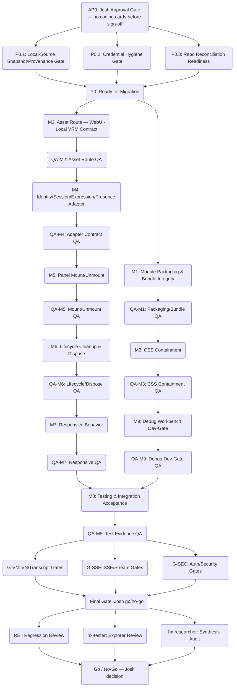

# Hyrax HQ + VN + 3D Integration — Implementation DAG (Rewrite: Local-Source Migration)

**Generated:** 2026-07-22 · **Rewritten:** 2026-08-05 (t_612469e5, after completed audit/architecture/QA chain)
**For Approval:** Josh (do not create downstream cards until approved; every coding card requires explicit human approval)
**Status:** Target lock — local-source migration. No code/config/runtime/Git changes were made by this rewrite; this is a documentation plan only.

---

## 1. Summary & Invariants

- **Sole implementation source:** the audited Gestalt control-plane embodiment module —
  `/root/workspace/gestalt-control-plane/frontend/src/embodiment/` (14 files, 3,380 lines, verified exact
  line counts by parent QA t_322f31fc). **Design/spec source:** `/workspace/gestalt/`.
- **Integration target:** `joshhmann/hermes-webui-hyrax` at `static/hyrax/3d/` (built bundle) +
  `hyrax-3d/` (in-repo Vite dev tree) + `api/hyrax_routes.py` (WebUI-local route extensions).
- **CT 112 is fully outside scope.** Zero CT 112 inventory, extraction, donor-asset, parity, iptables,
  iframe, Caddy, fallback, or network-dependency nodes exist in this DAG. All CT 112 references in the
  parent chain are historical/contextual only (ADR-3, I9).
- **Current-state reconciliation (2026-08-05):** the migration has been *substantially executed* in this
  repo since the parent chain completed (2026-07-22). Cards below are scoped as **verify / close-out /
  gap-close** against the artifacts that already exist on disk — they must NOT re-implement or rebuild
  what is present. Section 3 lists the on-disk evidence per card.
- **No reimplementation of existing components:** `TaiRoomScene`, `mountTaiLoft`, rig, face/gaze,
  visemes, atmosphere, navigation, locomotion, room manifest, or debug tooling are NOT scheduled for
  reimplementation — the parent audit found no evidence-backed adaptation gap for them (completeness
  verdict: complete, working 3D room implementation; the only gaps were the control-plane VRM path —
  now resolved via `/api/hyrax/assets` — and missing tests).
- **Every implementation card is XS/S/M**, DeepSeek-ready, with exact in-scope paths, prohibited paths,
  tests/evidence, rollback, and a dependent independent QA card.
- **All VN/SSE/transcript/auth/security gates are preserved** (Section 5) — the DAG keeps them as
  verification gates, never drops them.
- **Final fan-out preserved:** Rei regression review, hx-tester explorer, hx-researcher explorer
  (parallel), then a single go/no-go gate (Josh).
- **Community WebUI core boundaries preserved:** no edits to `api/routes.py` core handlers, `static/panels.js`,
  `static/boot.js`, `static/ui.js`, `api/kanban_bridge.py`. No mandatory global Node build — the isolated
  `hyrax-3d/` Vite bundle is the only build, outputting directly to `static/hyrax/3d/`.
- **Provenance invariant:** implementation copies/adapts only from the audited control-plane paths
  (frozen by `hyrax-3d/SOURCE_SNAPSHOT.json`, captured 2026-07-23) — never from CT 112.

---

## 2. Authoritative Source → Destination Map

From parent audit t_76a92d9d (completeness verdict) + architecture rev. 3 Section 7 + QA review t_322f31fc
(14/14 line counts exact, 3,380 lines total).

### Direct-Adapt Modules (already adapted in `hyrax-3d/src/embodiment/` — verify, do not re-port)

| Source (control-plane) | Target (in-repo) | Adaptation needed |
|---|---|---|
| `TaiRoomScene.ts` (445) | `hyrax-3d/src/embodiment/TaiRoomScene.ts` | VRM URL at call site (TaiRoomScene.ts:127) → WebUI-local path; expression update hook; dispose-during-mount guard |
| `mountTaiLoft.ts` (75) | `hyrax-3d/src/embodiment/mountTaiLoft.ts` + `hyrax-3d/src/index.ts` entry | Adapter-provided container; dev UI controls removed; `onExit` → VN mode switch; `vrmUrl` + `development` options |
| `rig/AvatarRig.ts` (636) | `hyrax-3d/src/embodiment/rig/AvatarRig.ts` | None |
| `locomotion/ProceduralLocomotion.ts` (432) | `hyrax-3d/src/embodiment/locomotion/ProceduralLocomotion.ts` | None |
| `navigation/RoomNavigation.ts` (491) | `hyrax-3d/src/embodiment/navigation/RoomNavigation.ts` | None |
| `face/FaceController.ts` (83) | `hyrax-3d/src/embodiment/face/FaceController.ts` | None |
| `face/GazeSystem.ts` (135) | `hyrax-3d/src/embodiment/face/GazeSystem.ts` | None |
| `voice/VisemeController.ts` (78) | `hyrax-3d/src/embodiment/voice/VisemeController.ts` | None |
| `atmosphere/TimeOfDaySystem.ts` (143) | `hyrax-3d/src/embodiment/atmosphere/TimeOfDaySystem.ts` | None |
| `loaders/loadModel.ts` (38) | `hyrax-3d/src/embodiment/loaders/loadModel.ts` | None (already accepts URL param — loadModel.ts:11) |
| `types.ts` (397) | `hyrax-3d/src/embodiment/types.ts` | None |
| `room/roomObjects.json` (168) | `hyrax-3d/src/embodiment/room/roomObjects.json` | Copy as-is (also mirrored in static asset path) |
| `tai-room.css` (41) | `hyrax-3d/src/embodiment/tai-room.css` → bundled `static/hyrax/3d/embodiment-bundle.css` | Rename/contain for WebUI (scoped selectors) |

### WebUI-Specific Adaptation (executed; verify contract)

| Concern | Resolution (on disk) |
|---|---|
| VRM asset URL `/api/v1/assets/tai.embodiment.vrm` | → `/api/hyrax/assets/tai.embodiment.vrm` via `api/hyrax_routes.py` allowlist (`ASSET_ALLOWLIST`, fail-closed, traversal/symlink checks) + production default in `hyrax-3d/src/index.ts` |
| `mountTaiLoft()` entry | → `mountTaiLoft(host, onExit, {vrmUrl, development})` exported from `hyrax-3d/src/index.ts`; cleanup function returned |
| Debug workbench | Dev-gated: `development: false` production default; debug pages under `static/hyrax/3d/debug/` (`ardy.html`, `ardy.js`, `StudioProfileRuntime.js`) served via `/api/hyrax/3d/*` — see M9 |
| Other control-plane APIs | VN conversations/SSE → native `/api/hyrax/vn/*` (session adapter); presence/essence → `/api/hyrax/presence`, `/api/hyrax/essence/*`; all same-origin, no sidecar/`:8770` dependency |

### Assets Requiring Review (per architecture rev. 3 + audit)

| Asset | Source | Risk / Status |
|---|---|---|
| Tai's VRM model | Allowlist entry `tai.embodiment.vrm` → `embodiment/tai.embodiment.vrm` | Licensing must be verified (created by us or permissively licensed) — QA gate G_sec |
| Room textures / animations | Procedural in TypeScript | No licensing risk |
| Sound / ambient audio | Not present in module | N/A — out of scope |

---

## 3. Current-State Reconciliation (2026-08-05, on-disk evidence)

The following already exist in this repo. Cards MUST verify/close-out these, not rebuild them:

| Artifact | Path | Evidence |
|---|---|---|
| Provenance snapshot (14 files, sha256) | `hyrax-3d/SOURCE_SNAPSHOT.json` | Captured 2026-07-23, `combined_sha256` + per-file digests |
| In-repo Vite dev tree | `hyrax-3d/` (`package.json`, `vite.config.ts`, `tsconfig.json`, `src/index.ts`, `src/embodiment/**`, tests/) | Tracked in git; builds to `../static/hyrax/3d` |
| Built bundle + CSS | `static/hyrax/3d/embodiment-bundle.js`, `embodiment-bundle.css` | Tracked in git; `mountTaiLoft` export present |
| 3D launch/mount/dispose adapter | `static/hyrax/hq.js` — `launch3d()`, `dispose3d()` (exact-once), `inject3dCss()`, `renderLoftFailure()`, `returnToConversation()`, exports `mount/unmount/launch3d/show2d`, window hooks `__hqLaunch3d/__hqShow2d/__hqMount/__hqUnmount` | Lazy import, `_mountGen` panel-switch guard, no uncaught rejection |
| WebUI-local asset route | `api/hyrax_routes.py` — `/api/hyrax/assets/<name>` allowlist, `/api/hyrax/3d/*`, `/api/hyrax/vn/*`, `/api/hyrax/presence`, `/api/hyrax/essence/*` | No monkey-patching, no import-time side effects |
| VN runtime (native) | `static/hyrax/vn/` (vnShell, vnSession, vnEvents, vnStage, vnDialogue, vnComposer, vnApprovals, vnActions, vnSidebar, vnTechDrawer, rooms/*.json) + essence bridge `static/hyrax/essence/` | Native `/api/hyrax/vn/conversations/{sid}/events` EventSource |
| Panel registration | `static/hyrax/bootstrap.js` — `HYRAX_PANELS = [{id:'hq'},…]`, `MAIN_ONLY_PANELS`, sidebar fallback | HQ panel only; retired panels gone |
| Tests | `hyrax-3d/tests/*.test.mjs` (contracts, ardy_motion, scene_manifest, goal_planner, pickup_system, lifecycle, …) | Unit-level coverage exists; integration acceptance (Section 14 adapted) not yet evidenced |

---

## 4. Implementation Plan (DAG)



### Key

```mermaid
classDef gate fill:#fbe6a2,stroke:#a2902e,stroke-width:2px;
classDef spike fill:#daf6ed,stroke:#20866f,stroke-width:2px;
classDef qa fill:#eed2d6,stroke:#a23245,stroke-width:2px;
classDef impl fill:#e3e6fb,stroke:#5742bb,stroke-width:2px;
classDef infra fill:#dadada,stroke:#505050,stroke-width:2px;
```

**Acyclicity & uniqueness:** every node ID above is unique; edges flow strictly Phase 0 → 1 → 2 → 3 with
no cycles. Dependencies are exact: a card starts only when its listed parents' QA gates pass.

---

## 5. Card Details (all XS/S/M — DeepSeek-ready)

### Phase 0 — Local-Source Provenance & Readiness

**AP0: Josh Approval Gate**
- Objective: Human sign-off that the migration may proceed. No coding card may be created or dispatched
  before this gate passes. This task created no cards.
- Evidence: Josh signature/comment on this plan.

**P0.1 — Local-Source Snapshot/Provenance Gate (XS, spike)**
- Objective: Freeze and verify the audited source snapshot so all downstream copies/adaptations trace to
  one immutable provenance record.
- Scope: `hyrax-3d/SOURCE_SNAPSHOT.json` (already exists, captured 2026-07-23, 14 files, per-file sha256
  + combined digest). Verify every `source_path` under `/root/workspace/gestalt-control-plane/frontend/src/embodiment/`
  matches the recorded digest; regenerate the snapshot if the control-plane source has drifted (record new
  digest + capture timestamp). Record the control-plane git ref used.
- Prohibited: reading or copying from CT 112 (`192.168.0.96:8000`); modifying any file outside
  `hyrax-3d/SOURCE_SNAPSHOT.json`.
- Tests/evidence: `sha256sum -c` style verification output; snapshot JSON committed.
- Rollback: revert the snapshot file only (no code involved).
- QA: none separate — verified by P0_ready gate (evidence listed in card output).

**P0.2 — Credential Hygiene Gate (XS, infra)**
- Objective: Prove zero credential/token exposure in `ps aux`, `systemctl show`, `/proc/*/cmdline`, and
  all logs; credentials come from restricted envfile only (architecture §10.1, invariant I4 — the exposed
  credential is never reproduced anywhere).
- Prohibited: printing, committing, or referencing the credential text.
- Evidence: redacted process/env inspection output.
- Rollback: n/a (verification only).

**P0.3 — Repo Reconciliation Readiness (XS, infra)**
- Objective: Confirm repository state is safe for the migration's Git interactions:
  `api/hyrax_routes.py` diff preserved/tracked (I2), fork reconciliation branch strategy per architecture
  §9, working tree clean of unrelated changes before any migration commit.
- Prohibited: blind upstream merges; silent `hyrax_routes.py` edits.
- Evidence: `git status` / `git log` summary.
- Rollback: n/a (verification only).

### Phase 1 — Bounded Migration Cards

**M1 — Module Packaging & Bundle Integrity (S, impl)**
- Objective: Verify the in-repo `hyrax-3d/` Vite tree is the single packaging source and the built bundle
  is current and reproducible — do NOT rebuild from scratch.
- In scope: `hyrax-3d/` (`package.json`, `vite.config.ts`, `src/index.ts`, `src/embodiment/**`),
  `static/hyrax/3d/embodiment-bundle.js` + `.css`. `vite build` from `hyrax-3d/` must reproduce the
  tracked bundle (outDir `../static/hyrax/3d`); confirm `mountTaiLoft` export; confirm bundle loads
  without a global WebUI Node build.
- Prohibited: editing WebUI root `package.json`, `vite.config.*`, or any core build files; re-importing
  source from `/root/workspace/gestalt-control-plane` beyond the frozen snapshot; Three.js/VRM version
  changes outside the module's pinned deps.
- Tests/evidence: `npm run build` (or `build:test`) output; bundle hash before/after; diff of rebuilt vs
  tracked bundle (expected: identical or documented drift with reason).
- Rollback: `git checkout` the tracked bundle paths; revert any `hyrax-3d/` diff.
- Dependent independent QA: QA-M1.

**M2 — Asset Route: WebUI-Local VRM Contract (S, impl)**
- Objective: Verify the control-plane-specific `/api/v1/assets/tai.embodiment.vrm` is fully resolved
  through the WebUI-local contract `/api/hyrax/assets/tai.embodiment.vrm` and that no control-plane API
  reference remains anywhere in the 3D path.
- In scope: `api/hyrax_routes.py` (`ASSET_ALLOWLIST`, `/api/hyrax/assets` handler),
  `hyrax-3d/src/index.ts` production default, `hyrax-3d/src/embodiment/TaiRoomScene.ts` call site (was
  line 127), `static/hyrax/hq.js` `launch3d()` vrmUrl argument, the VRM file under the allowlist base.
- Prohibited: `/api/v1/assets` references; direct filesystem paths in the browser; path traversal or
  symlink escapes (must remain fail-closed per hyrax_routes.py design); adding non-allowlisted assets.
- Tests/evidence: grep for `/api/v1/assets` across `static/hyrax/**` + `hyrax-3d/**` (must be zero);
  `GET /api/hyrax/assets/tai.embodiment.vrm` returns 200 with correct content-type; unknown asset names
  return sanitised 404; traversal attempts rejected.
- Rollback: revert allowlist/handler diff (route file is small and independently revertible).
- Dependent independent QA: QA-M2.

**M3 — CSS Containment (XS, impl)**
- Objective: Verify the 3D styles (bundled `embodiment-bundle.css`, lazy-injected by `inject3dCss()` in
  `hq.js`) are contained and do not leak into core WebUI chrome or other panels.
- In scope: `hyrax-3d/src/embodiment/tai-room.css` (source), `static/hyrax/3d/embodiment-bundle.css`
  (built), `static/hyrax/hq.js` `inject3dCss()`, `static/hyrax/hyrax.css` (no duplicate/conflicting rules).
- Prohibited: global/unescoped selectors affecting `#app`, `.sidebar`, `.chat`, native panels; editing
  core `static/` stylesheets.
- Tests/evidence: selector audit (all 3D rules prefixed/scoped); visual diff of core UI with 3D CSS
  loaded vs not; no layout shift outside the loft host.
- Rollback: revert CSS/bundle diff.
- Dependent independent QA: QA-M3.

**M4 — Identity/Session/Expression/Presence Adapter (S, impl)**
- Objective: Verify the direct-JS adapter contract between WebUI and the 3D module — identity
  (sister/profile), session (active conversation), expression (VN SSE → 3D), presence (who is in the
  room) — all same-origin, no second runtime, no postMessage/iframe (architecture §8).
- In scope: `static/hyrax/hq.js` (`launch3d`, `returnToConversation`, window hooks),
  `static/hyrax/vn/vnStage.js` + `static/hyrax/essence/*` (expression family bridge), `api/hyrax_routes.py`
  (`/api/hyrax/presence`, `/api/hyrax/essence/*`), `hyrax-3d/src/index.ts` options surface.
- Prohibited: new gateway/sidecar/WebSocket to another backend; postMessage bridges; iframe embedding;
  duplicate auth/profile ownership (WebUI owns auth/profiles/sessions/streaming — architecture §8 table).
- Tests/evidence: enter-room carries profile id + conversation id; VN SSE expression events reach the 3D
  expression surface (or evidence-backed gap card if the bridge is missing — bounded S); presence list
  updates; zero network calls to control-plane/CT 112 hosts.
- Rollback: revert adapter diff in `hq.js`/`vn*` (2D fallback path `render2dFallback` remains the safe
  revert state).
- Dependent independent QA: QA-M4.

**M5 — Panel Mount/Unmount (S, impl)**
- Objective: Verify HQ panel mount/unmount + 3D mode enter/exit integrate with WebUI panel lifecycle:
  `bootstrap.js` registration, `hq.js` `mount/unmount` exports, `_mountGen` panel-switch guard, exact-once
  `dispose3d()`, exit/failure returns to the SAME conversation (returnToConversation).
- In scope: `static/hyrax/bootstrap.js`, `static/hyrax/hq.js` (mount/unmount/launch3d/dispose3d),
  `static/hyrax/vn/vnShell.js` (`__hqLaunch3d`/`__hqShow2d` hooks).
- Prohibited: modifying core `switchPanel`/panel lifecycle code in `static/` core files; leaving orphaned
  DOM on unmount.
- Tests/evidence: HQ→VN→loft→exit→VN cycles; HQ→Chat→HQ panel switch while 3D active restores state
  without error/leak; no duplicate canvas/DOM on re-entry.
- Rollback: revert `hq.js`/`bootstrap.js` diff; 2D map fallback is the rollback state.
- Dependent independent QA: QA-M5.

**M6 — Lifecycle Cleanup & Dispose (S, impl)**
- Objective: Verify the 9-point dispose contract (architecture §8 invariant I7): renderer.dispose +
  canvas removal, animation loop cancel, event-listener removal, audio close, connection close, object-URL
  revocation, asset-cache clear, scene-graph disposal, promise-rejection guard — plus `dispose3d()`
  exact-once semantics.
- In scope: `static/hyrax/hq.js` `dispose3d()`, `hyrax-3d/src/embodiment/mountTaiLoft.ts` returned
  cleanup, `hyrax-3d/tests/lifecycle.test.mjs`.
- Prohibited: leaving GPU/RAF/listener leaks; disposing twice (must be idempotent).
- Tests/evidence: 5× enter/leave with no memory growth (Chrome Performance); heap snapshot shows zero
  retained `THREE.WebGLRenderer`; no `requestAnimationFrame` after dispose; lifecycle test file passes.
- Rollback: revert cleanup diff.
- Dependent independent QA: QA-M6.

**M7 — Responsive Behavior (S, impl)**
- Objective: Close the mobile/responsive verification gap (parent QA RC-2 / RV-3): VN stage and 3D
  canvas behave at narrow widths (375 px) — portrait scaling, dialogue box full-width below 768 px,
  composer usable, canvas respects devicePixelRatio.
- In scope: `static/hyrax/hyrax.css` (media queries), `static/hyrax/vn/*` stage/composer,
  `hyrax-3d/src/embodiment/` renderer sizing, `static/hyrax/3d/embodiment-bundle.css`.
- Prohibited: layout regressions at desktop width; new global stylesheets.
- Tests/evidence: screenshot matrix at 375/768/1440 px (desktop, narrow, mobile states); no horizontal
  overflow in VN stage; canvas reflows on resize.
- Rollback: revert CSS/layout diff.
- Dependent independent QA: QA-M7.

**M8 — Testing & Integration Acceptance (S, impl)**
- Objective: Consolidate evidence that the migrated module works without the control-plane or CT 112 —
  the clean integration acceptance test replacing the old iptables independence test (architecture §14,
  adapted: local-only proof, no network-blocking, no CT 112 shutdown).
- In scope: `hyrax-3d/tests/**` (run full suite via `npm test`), `hyrax-3d/tests/lifecycle.test.mjs`,
  `test:lifecycle` script; manual acceptance steps: HQ → VN → enter room → interact → leave → re-enter →
  WebUI-native panels; zero JS console errors referencing control-plane endpoints.
- Prohibited: iptables rules; CT 112 shutdown/network manipulation; fabricating test evidence.
- Tests/evidence: `npm test` + `npm run test:lifecycle` output; acceptance run log; console-error grep.
- Rollback: n/a (verification card).
- Dependent independent QA: QA-M8.

**M9 — Debug Workbench Dev-Gate (XS, impl)**
- Objective: Decide and verify the debug workbench treatment per audit/QA evidence (not assumption):
  `RigDevelopmentPanel` (218 lines, dev-only diagnostics) and the ARDY debug pages
  (`static/hyrax/3d/debug/ardy.html`, `ardy.js`, `StudioProfileRuntime.js`) must be dev-gated — present
  in the dev tree, not reachable through the production UX.
- In scope: `hyrax-3d/src/embodiment/debug/RigDevelopmentPanel.ts` (behind `development` flag),
  `hyrax-3d/src/index.ts` (`development: false` default), `static/hyrax/3d/debug/*` serving via
  `/api/hyrax/3d/*` route.
- Prohibited: shipping the workbench in the production bundle path; removing the debug sources outright
  (they are the operator tooling); exposing debug routes without the existing route guard.
- Tests/evidence: production bundle grep shows no RigDevelopmentPanel code; `development: false` default
  confirmed; debug page reachable only via explicit dev URL.
- Rollback: revert flag/route diff.
- Dependent independent QA: QA-M9.

---

## 6. Preserved Gates — VN / SSE / Transcript / Auth / Security

These gates are carried over from the parent chain (architecture §5, §8, §10; QA review R1–R9) and remain
mandatory before the final gate. They verify — they do not re-plan — the executed native VN runtime.

- **G-VN (VN/Transcript gates):** R2/I6 — expression tags from SSE events are consumed by the VN
  renderer and MUST NOT be written to the native WebUI session transcript; R3 — configurable VN API base
  (`window.HYRAX_VN_API_BASE` / `HYRAX_SSE_ENDPOINT`); zero-tool profile contract (R5) honored by the
  VN session adapter; profile isolation (cross-profile reads rejected).
- **G-SSE (SSE/stream gates):** native EventSource on `/api/hyrax/vn/conversations/{sid}/events` streams
  without buffering; reconnect after `error` resumes with replay (after_event_id) and no duplicate
  backlog entries; stream close on 3D entry is deliberate and reopens on return (hq.js `vnCloseStream`/
  `vnReopen` path).
- **G-SEC (Auth/security gates):** all `/api/hyrax/*` endpoints require the WebUI session
  (auth on/off both handled — fail closed); asset allowlist is fail-closed with traversal/symlink
  rejection; CSP stays same-origin (`frame-src 'self'`, no iframe extension); credential hygiene from
  P0.2 holds; no cross-tenant keystore writes; no secrets in docs/logs/configs.

Each gate requires explicit evidence (test output, greps, redacted inspection) recorded on its QA card
before FINALGATE.

---

## 7. Reference / Prohibited / Blockers

- Prohibited anywhere in this DAG: CT 112 extraction or re-port; `iptables` rules; iframe/postMessage
  bridges; Caddy reverse-proxy; sidecar `:8770` runtime dependency; control-plane `/api/v1/assets` calls;
  global Node build requirements; edits to core WebUI (`api/routes.py` core handlers, `static/panels.js`,
  `static/boot.js`, `static/ui.js`, `api/kanban_bridge.py`); credential handling of any kind in code.
- Blockers from the parent chain (R1–R9, RV-1/2/3, RC-1/2) are either resolved in the executed migration
  (R1 SSE sidecar → native stream; R6 postMessage → direct JS; RC-1 VRM call-site note; RV-1 wired as
  M8) or preserved as gates (R2/I6, R3, R5, R7, RV-2 in M5/M6, RC-2/RV-3 in M7).
- Every implementation card has a dependent independent QA card (QA-M1…QA-M9) with its own evidence
  requirement, and every QA gate must pass before its downstream card starts.

---

## 8. Document Checks (Target Lock Readback)

- [x] DAG is acyclic; every placeholder ID is unique and descriptive (P0.x, M1–M9, QA-M*, G-*, RF_*).
- [x] Exact dependencies: each edge is a stated parent→child dependency with a QA gate between impl cards.
- [x] Zero CT 112 operational content: no inventory, extraction, donor-asset, parity, iptables, iframe,
      Caddy, fallback, or network-dependency nodes remain.
- [x] Existing local implementation is the sole implementation source (14 files, 3,380 lines, snapshot-
      pinned) — no duplicate re-port cards.
- [x] No reimplementation of TaiRoomScene, mountTaiLoft, rig, face/gaze, visemes, atmosphere, navigation,
      locomotion, room manifest, or debug tooling (audit found no adaptation gap; M9 gates the workbench).
- [x] All coding cards are XS/S/M, DeepSeek-ready, with exact in-scope paths, prohibited paths,
      tests/evidence, rollback, and dependent independent QA.
- [x] VN/SSE/transcript/auth/security gates preserved (Section 6).
- [x] Final parallel fan-out preserved: Rei, hx-tester explorer, hx-researcher explorer → go/no-go.
- [x] All coding cards remain behind Josh's explicit approval (AP0); no cards were created by this task.
- [x] No code/config/runtime/Git changes made by this rewrite — documentation only.

---

*End of rewritten DAG. Awaiting Josh's approval before any card creation or dispatch.*
