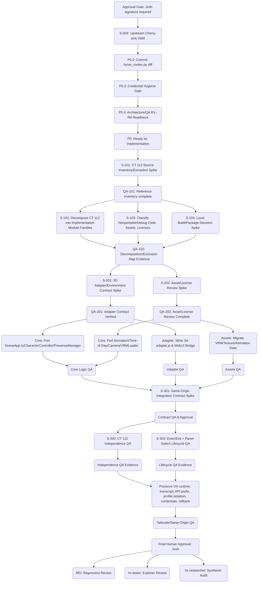

# Hyrax HQ + VN + 3D Integration — Implementation DAG (Target Lock, Local 3D Room Port)

**Generated:** 2026-07-22  
**For Approval:** Josh (do not create downstream cards until approved; all cards require explicit human approval)

## 1. Summary & Invariants

- Implements a self-contained HQ/VN/3D local port per revised architecture (v2, all QA/required-changes incorporated)
- CT 112 is reference/donor only; all runtime dependency on CT 112 is removed — no iframe, no remote asset, no Caddy, no postMessage, no socket, no fallback dependency.
- Only one sidebar panel: HQ (with internal HQ-map/VN/3D sub-modes); Projects/War Room/Dispatch/Verify/Promises are fully retired to WebUI native.
- Extraction, decomposition, QA, and implementation cards are granular: XS/S/M only, each with explicit module/file list, exclusion scope, and dependent QA. No direct implementation of the full 3D system in L/XL cards.
- All implementation cards require explicit Josh approval before downstream dispatch; each implementation card has a sibling QA/verification card.
- Upstream integration uses cherry-pick/reconciliation only. The pre-existing uncommitted api/hyrax_routes.py diff must survive as a tracked 7th commit post-cherry-pick.
- Every blocker, QA item (R1–R9), and advisory edge from QA review is present as a spike, spec, infra, or QA vertex in the DAG.

---

## 2. Implementation Plan (DAG)

### Key
classDef gate fill:#fbe6a2,stroke:#a2902e,stroke-width:2px;
classDef spike fill:#daf6ed,stroke:#20866f,stroke-width:2px;
classDef qa fill:#eed2d6,stroke:#a23245,stroke-width:2px;
classDef impl fill:#e3e6fb,stroke:#5742bb,stroke-width:2px;
classDef spec fill:#ebe7cb,stroke:#776f38,stroke-width:2px;
classDef test fill:#cff1fb,stroke:#317a90,stroke-width:2px;
classDef infra fill:#dadada,stroke:#505050,stroke-width:2px;
classDef review fill:#f2e6fe,stroke:#761fa3,stroke-width:2px;

---

## 3. Target Lock Implementation Cards

### 0. Approval & Stabilization (Explicit Gates)

**AP0: Final Approval Gate — Josh Must Sign Off**
  - Objective: Human-initiated green-light for the DAG below. Do not create or dispatch downstream/implementation cards without explicit human approval.

**P0.1: Cherry-pick Validation (S-004)**
  - Validate cherry-pick path for Hyrax commits and pre-existing diff per architecture. Proven via `git diff hyrax-reconciliation master`. Uncommitted api/hyrax_routes.py diff must be stashed/committed before cherry-pick; confirm clean fast-forward and match.

**P0.2: Commit hyrax_routes.py Diff**
  - Preserve all code updates to api/hyrax_routes.py as a tracked 7th commit after cherry-pick to ensure no loss in reconciliation. Only git/tracked-file actions; no unrelated logic edits.

**P0.3: Credential Hygiene Gate**
  - Prove zero credential/token exposure in `ps aux`, `systemctl show`, `/proc/*/cmdline`, and all logs. Credentials/use-tokens must come from restricted envfile only. No exceptions.

**P0.4: QA/Spec-Change Readiness (R1–R9)**
  - All architecture/QA gating items, blockers (R1–R9, RV-1 to RV-3, see review), and spike edges must be explicitly documented as drivers for the resulting implementation plan. No omitted gates or unaddressed review findings.

#### Gate: P0_ready (All stabilization/prep gates must pass before implementation fan-out)

---

### 1. Donor System Inventory/Extraction & QA Gating

- **S-101**: Inventory CT 112's source files (~54 files) by port category per extraction map: (1) Direct-port modules (SceneApp, CharacterController, etc.); (2) Environment-specific/adaptation modules; (3) Assets requiring license/provenance check; (4) Debug/dev-only files for omission. Output: module-by-module checklist with line count, adaptation notes, license status, explicit exclusions.
- **QA-101**: Independent review — evidence for extracted inventory must list *every* file plus rationale for category (direct/adapter/asset/omit).

#### Gate: QA-101 (Inventory evidence, prior art check, QA review)
  - QA: QA1_vn

---

### 2. Decompose Donor System & Prepare Local Packaging Plan

- **S-102**: Decompose each direct-port module/category from S-101 into XS/S/M implementation units. No card may cross a subsystem or represent more than 2 full file-units. List exact source/target module files, with explicit rationale for *exclusion*.
- **S-103**: Classify all non-portable code (debug overlays, hot-reload, test harnesses), required manual adaptation (auth/session, WebSocket → adapter, dev server overlays), donor-license/provenance evidence for each asset, and target all dev-only modules for omission from port.
- **S-104**: Decide local 3D build/package plan — pre-built Vite bundle, no changes to core WebUI build, QA-readiness. Define output target, test for static-only load, ensure asset/adapter isolation.
- **QA-102**: Decomposition/Exclusion QA — evidence for decomposition strategy, exclusion mapping, and packaging plan. Must enumerate rationale for all out-of-scope or debug modules.

---

### 3. Local 3D Adapter/Environment Contract & Asset Review

- **S-201**: Define adapter and environment contract surface. Adapter must translate all VN/HQ/3D state (enter/exit, identity, expression, presence, conversation context, events, error/cleanup bridge) into direct JS calls. *No* postMessage, *no* iframe dependency (see Section 8 contract in architecture; QA-confirmed invariants for cleanup/disposal).
- **S-202**: Asset/license review — VRM, room textures, animation data, sound/ambient audio. Each asset must be confirmed safe-to-port, have explicit provenance, and licensing notes.
- **QA-201**: QA verified adapter contract — must match Section 8 in architecture, explicit events for all 3D lifecycle transitions and cancellation/disposal requirements.
- **QA-202**: Asset/License review complete (per-asset evidence and readiness).

---

### 4. Local Implementation (XS/S/M Only; Per-Subsystem QA)

- **IL-01**: Port SceneApp.ts, CharacterController, PresenceManager (code-only; one card per module, clearly delineate lines/function ownership, no monolithic merges)
- **IL-02**: Port Animation/Time-of-Day/Camera/VRMLoader (precisely defined code boundaries, explicit artifact list)
- **IL-03**: Implement 3d-adapter.js (per-environment contract); QA must verify enter/leave, state relay, error/cleanup handling
- **IL-04**: Migrate VRM/Texture/Animation/Audio assets per asset/adapter QA pass only
- **QA-301**: Core logic QA (unit/intermediate asset rendering, error handling, memory management, event contracts)
- **QA-302**: Adapter QA (contract coverage, enter/exit, events, error propagation/DOM resource cleanup)
- **QA-303**: Asset/License/Disposal QA (bit exact asset load, provenance chain, all cleanup invariants from architecture Section 8)

---

### 5. Integration Contract — Same-Origin & QA Edges

- **S-301**: Define and verify same-origin bridge/integration contract between VN/HQ/3D. Eliminate all network/remote references; review Tailscale exposure and same-origin serving assumptions (see QA-202 and architecture Section 14, Independence Test).
- **QA-401**: Acceptance/contract QA. Confirm via evidence: all entry/exit flows, direct JS bridge, zero reference to remote iframe, postMessage, or Caddy.

---

### 6. CT 112 Independence & Lifecycle QA (Explicit Gates)

- **S-302**: CT 112 Independence QA — iptables-block or shutdown CT 112; prove full HQ/VN/3D flow, all assets/functionality, no reference/fallback dependency. Evidence must cover enter/leave cycles, error/test handling, WebUI-native features, no network calls to 192.168.0.96.
- **S-303**: Enter/Exit + Panel/Lifecycle QA — multiple cycles, panel switch, QA evidence on repeated mount/dispose, DOM leak checks, performance, event/resource cleanup, both per-mode and whole-app state. RV-2 is covered as a mandatory subtest.
- **QA-501**: QA proof for S-302/S-303 (all lifecycle states: functional, teardown, memory/test evidence, audit log).

---

## 7. Reference/Prohibited/Blockers & QA R1–R9

- Prohibited: Any edit to core WebUI (api/routes.py, core boot/panels, DB), credential injection, cross-profile state/write, direct DB/socket calls, or upstream merges.
- Changes to deployment/tail origin must follow Tailscale/same-origin only; do not introduce new edge proxies, fallback servers, or build steps modifying vanilla core.
- Upstream reconciliation must always preserve pre-existing hyrax_routes.py; no silent merges, all deltas must be tracked in commit log.
- R1–R9, RV-1/2/3, and all prior blockers are explicitly captured as review, QA, or implementation edges in the DAG. Document their evidence status in QA gating steps.

---

## 8. Document Checks (Target Lock Readback)

- DAG is acyclic; every placeholder ID and card name is unique, descriptive, and DeepSeek-ready.
- Each implementation/spike/QA card includes objective, context, dependencies, scope, exclusions, explicit artifact/test/evidence/who-must-approve fields.
- Every implementation unit (XS/S/M only) has a paired downstream QA card and explicit Josh approval edge.
- CT 112 is only a non-blocking, read-only evidence/reference; strict QA (Section 14 test) must affirm its irrelevance before decommission phase.
- RV-1 and RV-2 incorporated: independence test is a gated step in decomposition phase, and lifecycle QA includes panel-switch/DOM lifecycle tests.
- Mobile/responsiveness test requirement (RV-3) is included as advisory (may be required by explorer/QA step per post-MVP cutover).
- No implementation or card creation is permitted before explicit human approval. Cutover, final regression, and go/no-go all require explicit human review and evidence handling.

---

*End of DAG. Awaiting approval before proceeding.*
