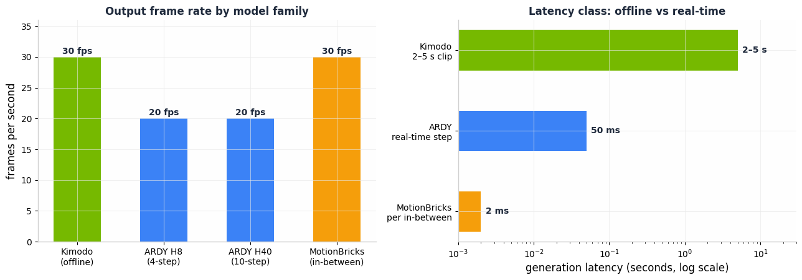
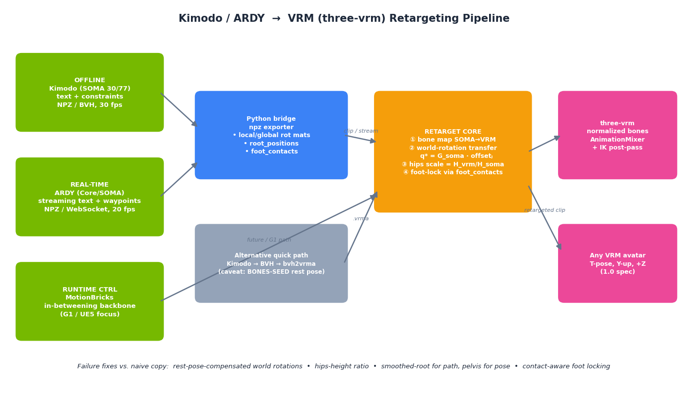

# Using NVIDIA Kimodo, ARDY, and MotionBricks with VRM Models: How They Work and How to Make Them Walk

## TL;DR

Kimodo (offline), ARDY (real-time), and MotionBricks (real-time in-betweening) all produce the same kind of payload: a **root trajectory plus per-joint rotations on a fixed skeleton**, at 20–30 fps, in a right-handed **Y-up, +Z-forward** coordinate frame whose zero pose is a **T-pose**. A VRM 1.0 avatar is also Y-up, +Z-facing, and its *normalized* rig rests in a T-pose — so the two worlds are compatible **if and only if** you retarget in world-rotation space with rest-pose compensation, rescale hips translation by the hips-height ratio, and clean up ground contact. The reason earlier Kimodo→VRM attempts fail to walk correctly is almost always some combination of: (1) copying *local* rotations onto VRM bones whose rest orientations differ, (2) applying the pelvis trajectory without proportion scaling, (3) driving the hips from Kimodo's *smoothed root* instead of the pelvis (a Kimodo-only trap — see the precision note below), and (4) skipping foot-locking. **Two traps specific to ARDY shipping checkpoints:** the released ARDY models use the **Core27** skeleton, *not* SOMA — and its joint names collide with SOMA's with inverted meaning (`LeftLeg` is the thigh in SOMA but the **knee** in Core27), so a SOMA bone map applied to an ARDY-Core export silently breaks the legs; and ARDY's quaternions are **w-first (w,x,y,z)** while three.js uses (x,y,z,w). The fix is a deterministic system — skeleton-aware bone map → rest-compensated world-rotation transfer → hips scaling with yaw ownership on the scene root → contact-aware foot locking → chunk/reset handling for streams — fully specified, with formulas and corrected code, in Sections 3–5.

> **Precision note (from first-party source audit).** This revision was reconciled against a line-level audit of the ARDY source (`nv-tlabs/ardy`). Corrections applied: ARDY's attention budget is **10 s** (not 8); in ARDY exports `smooth_root_pos` is a literal **alias** of `root_positions` (the smoothed-root distinction is Kimodo-only); ARDY ships **Core27/G1** skeletons (SOMA announced, not shipped) with name-colliding joint semantics; all ARDY quaternions are **(w,x,y,z)**; the interactive demo's session export is a **pickle with different keys**, not the NPZ; and streaming requires slicing history frames off every chunk and honoring reset boundaries. Claims about Kimodo/MotionBricks internals that cannot be checked against local source are marked *(external)*.

---

## 1. How the Three Models Work Under the Hood

### 1.1 Kimodo — the offline motion authoring model

Kimodo ("**Ki**nematic **Mo**tion **D**iffusi**o**n") is NVIDIA's 282M-parameter diffusion model for controllable human motion generation, released March 16, 2026 with code on GitHub (`nv-tlabs/kimodo`, Apache-2.0) and weights on Hugging Face [^19^][^10^]. It is trained on **700 hours of commercially-friendly optical mocap** (the Bones Rigplay dataset) and generates up to 10 seconds of motion at 30 fps from a text prompt plus an unusually rich set of kinematic constraints: full-body pose keyframes, sparse joint positions/rotations, end-effector targets, 2D waypoints, and dense 2D paths [^6^][^10^].

Three internal design decisions matter for anyone retargeting its output. **First, the motion representation.** Kimodo does not diffuse raw joint angles; it diffuses a feature vector per frame made of a *smoothed root position* (3), a *global root heading* as `[cos θ, sin θ]` (2), pelvis-relative joint positions, 6D global joint rotations, joint velocities, and four binary foot-contact channels — all in a right-handed, Y-up, +Z-forward frame [^93^]. The smoothed root is a low-pass-filtered version of the pelvis trajectory: it strips out the natural bob and sway of walking so that path-following constraints stay clean, while the pelvis is still free to move naturally around the smoothed curve [^93^][^22^]. **Important scoping:** this smoothed-root/pelvis distinction is **Kimodo-specific**. In ARDY's exported NPZ, `smooth_root_pos` is populated with the same tensor as `root_positions` — an alias, not a filtered path (verified in `ardy/motion_rep/reps/ardy_motionrep.py`) — so the "gliding on a rail" failure mode below applies to Kimodo data only. **Second, the two-stage denoiser.** One transformer first predicts the clean root motion, and a second transformer predicts body motion conditioned on that root; decomposing "where the character goes" from "how the limbs move" is credited with minimizing foot skating and improving constraint adherence [^22^][^6^]. **Third, inference-time control.** Generation uses DDIM sampling (default 100 steps) with a *separated* classifier-free guidance scheme that lets you weight text (`w_text`) and constraints (`w_constr`) independently, plus a foot-skate/constraint cleanup post-process you can disable with `--no-postprocess` [^6^][^10^].

For the retargeting problem, the most important fact is the output contract. Kimodo writes NPZ files (and a BVH alongside them) containing `posed_joints` `[T, J, 3]`, `global_rot_mats` `[T, J, 3, 3]`, `local_rot_mats` `[T, J, 3, 3]`, `foot_contacts` `[T, 4]`, `smooth_root_pos` `[T, 3]`, `root_positions` `[T, 3]`, and `global_root_heading` `[T, 2]` [^18^]. SOMA exports use the full **77-joint** `somaskel77` layout even though the model internally runs on the reduced 30-joint `somaskel30`, and the NPZ is written so that the zero pose is Kimodo's standard internal **T-pose** — whereas the BVH export defaults to the BONES-SEED rest-pose convention, a subtle trap discussed in Section 4.2 [^18^]. All training data shares one uniform skeleton proportion, so every Kimodo motion is authored for a single, fixed, known body [^20^].

### 1.2 ARDY — the real-time streaming successor

ARDY ("Autoregressive Diffusion with Hybrid representation") is NVIDIA Spatial Intelligence Lab's SIGGRAPH 2026 follow-up that takes essentially all of Kimodo's controllability and makes it stream in real time [^11^][^15^]. Where Kimodo denoises a whole clip in parallel (2–5 s on an RTX 3090), ARDY generates motion **autoregressively in short windows**, so a character can change behavior mid-stride when the user types a new prompt or drags a waypoint [^2^][^14^].

The architecture has two key ideas [^4^][^14^]. **A hybrid motion representation**: the root trajectory is kept *explicit* in global coordinates (so spatial constraints can overwrite it directly), while body motion is compressed into a compact latent embedding by an asymmetric conditional-autoencoder **motion tokenizer**. Notably, the decoder converts the global root into a *local* representation — heading angular velocity, linear velocity, and root height — which measurably reduces foot skating (0.264 m/s vs 0.303 m/s when ablated) [^14^]. **A two-stage autoregressive transformer denoiser**: a Root Transformer first predicts clean global root motion, which is then detached and fed into a Body Transformer that predicts the latent body tokens. At runtime, ARDY rolls out in generation windows (horizon 8 or 40 frames) with an attention window budget capped at **10 s of frames** (`session.max_window_len = (10 * fps // patch) * patch`), recenters each window's history root at the origin before re-offsetting the output back into scene coordinates, and hides inference latency with a **latency-aware replanning buffer** — already-generated frames play back while the next window is computed asynchronously [^12^]. Released checkpoints span the **Core27** and **Unitree G1** skeletons at 20/25 fps, with a SOMA variant announced as coming soon [^15^][^1^].

For VRM integration the practical contract is deliberately close to Kimodo's — with three audit-verified caveats. `scripts/generate.py` decodes with `motion_rep.inverse(...)` and writes an NPZ containing exactly `local_rot_mats`, `global_rot_mats`, `posed_joints`, `root_positions`, `smooth_root_pos` (aliased to `root_positions` in ARDY), `foot_contacts`, and `global_root_heading`, plus `fps` and prompt text. **Caveat 1:** the *interactive demo's* session export is a **pickle with different keys** (`joints_pos`, `joints_rot`, `root_velocities`, `motion_tensor`, `foot_contacts`, with `local_rot_mats`/`root_positions` added post-hoc) — no `global_rot_mats`; code written against the NPZ field list will not read a demo export. **Caveat 2:** the skeleton is Core27, not SOMA — same field contract, *different joint names with colliding semantics* (Section 3.2). **Caveat 3:** ARDY's quaternions are **w-first (w,x,y,z)** at every conversion boundary, while three.js `THREE.Quaternion` is (x,y,z,w) — an interop trap the moment you leave matrix space. Within those caveats, one retargeting layer genuinely serves both models; the only structural difference is that ARDY lets you consume frames as a live stream (the demo renders in a web-browser viewport via Viser) rather than as finished files [^15^].

### 1.3 MotionBricks — the real-time in-betweening framework

MotionBricks takes a different generative paradigm: **motion in-betweening** [^24^]. Its low-level backbone trains a conditional multi-head **VQ-VAE tokenizer** that encodes T frames of motion into T/4 discrete tokens, a **root module** that first predicts *timing* (how many frames the transition needs) and an initial root trajectory, and a **pose module** that models pose-token distributions conditioned on keyframe constraints and the root [^24^][^3^]. On top of the backbone sit "smart primitives": *smart locomotion* turns velocity/heading/style commands into proxy keyframes (with a critically-damped spring smoothing the naive extrapolated root before neural refinement), and *smart objects* turn scene interactions into denser keyframe sets — all communicating through one unified keyframe interface with no per-task fine-tuning [^24^]. The payoff is extreme speed: **~2 ms per in-between, ~15,000 fps throughput**, with robust handling of imperfect keyframes through periodic replanning [^24^][^25^].

Two caveats matter for VRM use. MotionBricks' public preview release lives inside `NVlabs/GR00T-WholeBodyControl/motionbricks` and is oriented at the **Unitree G1** robot and a UE5 demo, not at a general human skeleton for web use [^27^][^26^]. And its own authors state that "runtime retargeting (used in our UE5 demo) is fast but low-quality; offline retargeting (used for G1) is accurate but requires months of iteration" — an unusually honest admission that the retargeting layer, not the generator, is the hard part, which is exactly the problem this report solves for VRM [^24^].

### 1.4 One output contract, three speeds

The single most useful mental model is that all three systems converge on the same deliverable: root trajectory + joint rotations + foot contacts on a fixed skeleton. They differ in latency class, skeleton, and intended host.

| Property | Kimodo | ARDY | MotionBricks |
|---|---|---|---|
| Paradigm | Offline clip diffusion (DDIM, ~100 steps) [^6^] | Streaming autoregressive diffusion (chunked windows) [^12^] | Real-time neural in-betweening (VQ-VAE + root/pose modules) [^24^] |
| Latency | 2–5 s per ≤10 s clip [^10^] | Real-time, buffer-masked replanning [^12^] | ~2 ms per in-between (~15,000 fps) [^24^] |
| Output rate | 30 fps [^6^] | 20 fps (Core) / 25 fps (G1) [^15^] | 30 fps segments of 12–64 frames [^24^] |
| Skeletons (shipped) | SOMA (30/77), G1, SMPL-X [^20^] | **Core27**, G1 (SOMA announced) [^15^] | G1 / UE5 demo rig [^27^] |
| Quaternion order | w-first at export boundaries *(external)* | **(w,x,y,z)** everywhere (source-verified) | n/a |
| Controls | Text + keyframes, EE pos/rot, 2D waypoints/paths [^10^] | Online text + same kinematic constraints, long-horizon goals [^4^] | Velocity/heading/style commands, proxy keyframes [^24^] |
| Output format | NPZ + BVH (+AMASS for SMPL-X) [^18^] | NPZ (generate.py) / **pickle** (demo export) | Runtime buffer `{r, p, q, v, c}` [^3^] |
| Foot-contact data | Yes, 4 channels [^18^] | Yes (model-predicted, >0.5) | Implicit (decoder robustness) [^24^] |
| License | Apache-2.0 code / NVIDIA Open Model weights [^10^] | Apache-2.0 code / NVIDIA Open Model, commercial use allowed [^1^] | GR00T repo preview [^26^] |



The comparison chart makes the engineering trade-off explicit: Kimodo buys maximum quality and constraint richness at seconds-per-clip latency, ARDY moves the same capability into an interactive 20 fps stream, and MotionBricks lives in a different latency universe entirely (milliseconds) but currently targets robotics and UE5 hosts rather than a portable human skeleton you can drop into a web page. For a three.js/three-vrm target, **Kimodo (offline clips) and ARDY (live stream) are the two practical sources**, and MotionBricks is best treated as a reference architecture for how to structure replanning and root refinement on your own side.

---

## 2. Why Your VRM Model Wouldn't Walk Correctly — a Diagnosis

Retargeting failures between a diffusion-model skeleton and a VRM avatar cluster into five root causes, and walking is the motion that exposes all of them because it is periodic, contact-rich, and proportion-sensitive.

**Cause 1 — applying local rotations across incompatible rest poses.** Kimodo's `local_rot_mats` are parent-relative rotations defined against the SOMA skeleton's joint frames; a VRM avatar's bones have completely different rest orientations, bone roll, and (often) hierarchy depth. Copying local rotations bone-by-name therefore injects a constant per-bone error that looks like "the model sort of moves but everything is twisted." The correct transfer must go through **world space with rest-pose compensation**: compute the source bone's world-rotation *delta from its rest pose*, then apply that same delta to the target bone's rest orientation [^49^]. This is also why three.js's built-in `SkeletonUtils.retarget` has a long history of producing distorted results on mismatched rigs, as documented in the three.js forums [^28^].

**Cause 2 — unscaled root translation.** Kimodo trains on **one uniform skeleton proportion** [^20^]; your VRoid avatar's hips sit at a different height (ARDY Core27's pelvis, for reference, sits at ≈ **0.954 m** in its rest capture — measure it from `joints.p` rather than assuming). If you write the source pelvis trajectory straight into the VRM hips, the character either floats, sinks, or — because leg reach no longer matches the ground plan — appears to slide. The standard fix is to scale hips translation by the ratio of hips heights, which is exactly what the official three-vrm Mixamo example does (`hipsPositionScale = vrmHipsHeight / motionHipsHeight`) [^28^].

**Cause 3 — driving the hips from the wrong root channel (Kimodo-only trap).** Kimodo exports both `smooth_root_pos` (the low-pass path used for constraint following) and `root_positions` (the actual pelvis trajectory) [^18^]. The smoothed root deliberately removes the pelvis's natural bob and sway [^93^]; if you drive VRM hips from it, walking looks like gliding on a rail. **With ARDY data this failure mode cannot occur** — its `smooth_root_pos` is an alias of `root_positions` — but with Kimodo data the split still matters: pelvis (`root_positions`) drives the hips node, smoothed root drives *locomotion intent* (character controller, camera), never the pose. A related ownership bug affects both models: world yaw belongs on the **scene root**, and the hips bone must receive the pelvis orientation *with the scene yaw stripped* — otherwise yaw is applied twice and the avatar performs an "exorcist twist" when navigating.

**Cause 4 — no contact handling.** Diffusion models emit small but systematic foot-skate error (ARDY measures it at ~0.26 m/s in text-only generation even with its anti-skating design [^14^]), and retargeting across proportions multiplies it. Unreal's own guidance for fixing retarget foot sliding is to detect stance phases and pin the feet during them ("Speed Planting") [^56^]; naive single-reference ground correction fails precisely in walking, where the lowest foot alternates — the correct per-frame reference is the *minimum* of both feet, smoothed over time [^48^]. Kimodo and ARDY hand you the stance labels for free: four `foot_contacts` channels in the order **[left heel, left toe, right heel, right toe]**, thresholded at >0.5, where "heel" is the ankle joint (`*Foot`) and "toe" is `*ToeBase` (verified in ARDY source; the model *predicts* these, with heuristic ground truth of height < 0.10 m and speed < 0.15 m/s) [^18^]. Ignoring them is leaving the best fix on the table.

**Cause 5 — convention mismatches.** Kimodo's frame is right-handed, Y-up, +Z-forward [^93^]; ARDY's is verified identical (meters, Y-up, +Z-forward, heading 0 ⇒ facing +Z, ground plane XZ, all heading rotations about Y). VRM 1.0 is right-handed glTF, Y-up, and faces +Z [^29^] — aligned, so **no mirroring is needed for VRM 1.0**. But **VRM 0.x models face −Z**, and the official three-vrm retarget code compensates by negating the x and z components of positions and quaternion components for v0 models [^28^]; an alternative, equally valid mechanism is handling v0 through rest-pose normalization at init rather than per-component flips. Two further traps: Kimodo's BVH export defaults to the BONES-SEED rest pose rather than the T-pose [^18^], and — new in this revision — **ARDY quaternions are (w,x,y,z)** while three.js is (x,y,z,w). Mixing any of these produces the classic "walking backwards / moonwalk / bent arms" failures.

A useful way to summarize the diagnosis: the generative model is almost never the problem. MotionBricks' authors concede that even NVIDIA's own runtime retargeting is "fast but low-quality" [^24^], and industry retargeting guides attribute most visible failures to reference-pose mismatch, hierarchy divergence, and missing IK/contact passes rather than to the motion data itself [^51^]. Your system must therefore treat retargeting as a first-class pipeline stage, not a name-mapping afterthought.

---

## 3. The Retargeting System: Formula and Bone Maps

### 3.1 Conventions and setup

Both sides are prepared in a **shared auxiliary pose** — the T-pose. Kimodo's NPZ zero pose is a T-pose [^18^]; ARDY's frame/meter/T-pose conventions are source-verified. VRM 1.0 requires the model to be in T-pose, and three-vrm exposes a **normalized rig** whose rest pose is that T-pose with (by design) identity world rotations on every humanoid bone [^29^][^35^]. Retarget through the normalized rig (`getNormalizedBoneNode`) rather than the raw bones: it absorbs whatever messy bind pose the avatar artist left behind, and `vrm.humanoid.update()` propagates normalized rotations to the raw skeleton [^35^][^28^]. **One discipline the audit adds:** do not *assume* the source side's rest-pose global rotations are exactly identity or exactly the nominal T-pose — **measure them on first capture** from `joints.p`/frame data and use those measured values as `G_src_rest`. The full rest-compensated equation below stays correct either way; treating identity as guaranteed is what causes subtle lean/twist offsets.

You need, computed **once at load time**: for every mapped joint pair, the source rest world rotation `G_j^src` (measured) and the target rest world rotation `G_j^trg` (identity on the normalized rig), plus both hips heights for scaling. And whenever you convert between representations, remember: **ARDY quaternions are (w,x,y,z); three.js is (x,y,z,w)** — staying in rotation-matrix space (as the reference code does) sidesteps this entirely.

### 3.2 Bone maps — SOMA **and** Core27 (the skeleton ARDY actually ships)

This is the correction that matters most for ARDY users. The `somaskel30` hierarchy [^23^] and ARDY's `cskel27` are **different skeletons whose shared names mean different things**: in SOMA, `LeftLeg` is the *thigh* and `LeftShin` the knee; in Core27, `LeftUpLeg` is the thigh and **`LeftLeg` is the knee**. Applying the SOMA map to a Core27 NPZ maps the VRM thigh from a knee and the shin from a nonexistent joint — silently broken legs. Always select the map by skeleton, not by file format (ARDY's own `visualize.py` auto-detects the skeleton from the file; the NPZ joint count and names let you do the same).

**Core27 layout (verified from `ardy/skeleton/definitions.py:338-381`):** `Hips → Spine → Spine1 → Spine2 → Spine3 → Neck → Head`; `Spine3` parents **both** shoulders (`L/R Shoulder → Arm → ForeArm → Hand → HandEnd` plus a `HandThumb1` terminal); legs run `Hips → L/R UpLeg → Leg → Foot → ToeBase`. 27 joints total.

| VRM humanoid bone | SOMA (somaskel30/77) | ARDY Core27 | Notes |
|---|---|---|---|
| `hips` | `Hips` | `Hips` | Only bone with animated **translation**; scale by hips-height ratio [^28^] |
| `spine` | `Spine1` | `Spine` | SOMA: Hips→Spine1→Spine2→Chest; Core27: Hips→Spine→Spine1→Spine2→Spine3 |
| `chest` | `Spine2` | `Spine1` | Core27 `Spine2` parents the shoulders → map it to `upperChest` |
| `upperChest` | `Chest` | `Spine2` | VRM requires `chest` to exist before `upperChest` [^39^]; Core27 `Spine3` folds into `neck` |
| `neck` | `Neck1` | `Neck` | SOMA has Neck1+Neck2; fold Neck2 into `head` (compose world deltas) |
| `head` | `Head` | `Head` | |
| `leftShoulder` / `rightShoulder` | `LeftShoulder` / `RightShoulder` | same names | Clavicles; parented to `Chest` (SOMA) / `Spine2` (Core27) |
| `leftUpperArm` / `rightUpperArm` | `LeftArm` / `RightArm` | same names | |
| `leftLowerArm` / `rightLowerArm` | `LeftForeArm` / `RightForeArm` | same names | |
| `leftHand` / `rightHand` | `LeftHand` / `RightHand` | same names | Core27 terminals `*HandEnd`, `*HandThumb1` have no VRM counterpart |
| `leftUpperLeg` / `rightUpperLeg` | **`LeftLeg` / `RightLeg`** | **`LeftUpLeg` / `RightUpLeg`** | **Name collision!** SOMA `Leg` = thigh, Core27 `Leg` = knee |
| `leftLowerLeg` / `rightLowerLeg` | `LeftShin` / `RightShin` | **`LeftLeg` / `RightLeg`** | Core27 has no `*Shin` joints |
| `leftFoot` / `rightFoot` | `LeftFoot` / `RightFoot` | same names | Ankles; contact channel = "heel" |
| `leftToes` / `rightToes` | `LeftToeBase` / `RightToeBase` | same names | Contact channel = "toe" |
| fingers (all) | `L/R Hand{Thumb,Index,Middle,Ring,Pinky}1..3` | — | somaskel77 only; Core27 has no finger chains |

For **Kimodo-SMPLX**, the 22-joint body skeleton maps to the same VRM rows with SMPL-X names (`pelvis`, `spine1..3`, `left_hip`, `left_knee`, `left_ankle`, …), but NVIDIA itself warns the SMPL-X variant shows "particularly severe retargeting artifacts" and recommends SOMA instead [^20^].

### 3.3 The rotation-transfer formula

The canonical rest-pose-compensated retarget, documented for three.js by the UPF retargeting-threejs project, is [^49^]:

```
q_trg_local = invBindTrgWorldParent · bindSrcWorldParent · q_src_local · invBindSrcWorld · bindTrgWorld
```

where `bind*` are rest-pose world rotations. Working in **world space deltas** is the robust simplification, and it is what the official three-vrm Mixamo example implements [^28^] — and it matches, exactly and including multiplication order, the first-party ARDY integration architecture's derivation. Per frame `t`, per mapped bone:

```
ΔW(t)   = G_src(j,t) · inv(G_src_rest(j))              # world-space delta from source rest
W_trg(t)= ΔW(t) · G_trg_rest(j)                        # apply same delta to target rest
q_trg_local(t) = inv(W_trg_parent(t)) · W_trg(t)       # back to parent-relative
```

On the **normalized VRM rig**, `G_trg_rest(j) = I`, so the per-bone offset collapses to a single precomputed constant `offset_j = inv(G_src_rest(j))` (with `G_src_rest` **measured**, per Section 3.1), and the frame update is:

```
W_norm(j,t) = G_soma(j,t) · offset_j
q_norm_local(j,t) = inv(W_norm(parent,t)) · W_norm(j,t)
```

Set `q_norm_local` on the normalized bone nodes, call `vrm.humanoid.update()`, and the raw skeleton follows [^35^]. Because both models conveniently export **`global_rot_mats` directly** (ARDY: real, world-space `[T,J,3,3]` matrices reconstructed from 6D features via Gram–Schmidt — source-verified), you never need to run FK on the source side [^18^]. Traverse **parents before children** in an explicitly ordered bone list so parent world rotations are available exactly when needed — the standard topological solve [^52^]; relying on `Object.entries` insertion order happens to work but is fragile.

### 3.4 Root motion, hips scaling, and yaw ownership

Translation is retargeted for the hips only; every other bone is rotation-only (mirroring Unreal's "pelvis = AnimationScaled, everything else = Skeleton" rule [^36^]). The hips track is:

```
p_hips_vrm(t) = s · ( p_pelvis_src(t) − p_pelvis_src(0) ) + p_hips_vrm(0),
s = hipsHeight_vrm / hipsHeight_src
```

where `hipsHeight_src` is measured from the source rest pose (≈0.954 m for ARDY Core27) and `hipsHeight_vrm` from the normalized rig — the `hipsPositionScale` computation in the three-vrm example [^28^]. Use `root_positions` (the true pelvis — source-verified as an absolute world position in meters, not a velocity), never Kimodo's `smooth_root_pos`, for this track [^18^].

**Yaw ownership (the double-yaw trap).** The pelvis's full 3-DOF orientation — including pitch and roll — already lives in `global_rot_mats[0]`; `global_root_heading` is a *duplicated yaw channel* used for conditioning, not something the client must reconstruct. In a navigated scene (character controller moves the avatar), put **world XZ and yaw on the scene root** and give the hips bone the pelvis orientation **with the scene yaw stripped**: `q_hips = yawQuat(−sceneRootYaw) ⊗ pelvisGlobal`. Applying both spins the avatar twice ("exorcist twist"). For a fixed-camera clip player the simpler frame-0-anchored formula above is fine; for anything interactive, adopt the split. Kimodo's smoothed root remains useful at this layer as the *path proposal* your navigation approves or modifies — the same staging MotionBricks uses (naive → spring → neural root refinement) [^24^].

### 3.5 Contact-aware foot locking

The final stage removes residual skating using the `foot_contacts` channels `[left heel, left toe, right heel, right toe]`, thresholded >0.5 [^18^]:

1. **Ground offset per frame:** where a contact flag is set, the contacting foot should be at ground height. Compute `h(t) = min(leftFoot.y, rightFoot.y)` over contact-flagged feet after retargeting and apply `hips.y − smooth(h(t) − groundY)`, smoothing the correction over ~5–10 frames to avoid the visible "jump" naive snapping causes [^48^].
2. **Horizontal pinning (optional, strongest fix):** for each contact interval `[t0, t1]` where a foot's flag stays set, record the foot's world XZ position at `t0` and blend the foot toward that fixed point during the interval — either by nudging hips XZ (cheap) or by running a two-bone IK pass on the leg *after* `mixer.update()` and before skeleton update, the ordering three.js IK integrations require [^82^]. Same principle as Unreal's Speed Planting: detect stance from labels or foot speed, pin the IK goal while planted [^56^].
3. **Validate with the model's own metric:** foot-skate is measured as the speed of contacting joints (ARDY reports ~0.26 m/s text-only [^14^]); compute the same number before/after locking to confirm improvement rather than eyeballing it.



---

## 4. Three Integration Pipelines

### 4.1 Pipeline A (recommended): Kimodo/ARDY NPZ → retarget → three-vrm clip

Generate motion with the CLI (`kimodo_gen` or ARDY's `scripts/generate.py`) [^10^][^15^], run the Python exporter in Section 5.1 to convert the NPZ into a compact JSON of *global rotations + pelvis positions + contacts*, then build a `THREE.AnimationClip` in the browser using the retargeter in Section 5.2. The field contract is shared, so one exporter covers both — **provided it detects the skeleton** (somaskel30/77 vs cskel27) from the NPZ joint count/names and selects the matching bone map; hardcoding SOMA names against a Core27 file silently emits a 30-name list over 27 columns of data. Do not attempt this against the interactive demo's session export: it is a pickle with different keys and no `global_rot_mats` — re-save through `generate.py` or decode with `motion_rep.inverse()` yourself. This path gives full control of every fix in Section 3, works with any VRM 1.0 avatar, and the resulting clip plays through the normal `AnimationMixer` + `vrm.update(delta)` loop [^73^].

### 4.2 Pipeline B (fastest to try): Kimodo → BVH → .vrma

Kimodo writes a BVH next to the NPZ [^18^], and the VRM consortium's official `bvh2vrma` web app converts BVH files into `.vrma` animation files, which three-vrm loads with `VRMAnimationLoaderPlugin` and plays via `createVRMAnimationClip(vrmAnimation, vrm)` — the loader itself performs the destination-skeleton transform [^62^][^73^][^76^]. Two warnings: Kimodo's BVH uses the **BONES-SEED rest pose**, not the standard T-pose (the safest fix is to export with the standard T-pose convention or rebase the rest pose in a BVH editor first) [^18^]; and `bvh2vrma` carries no result guarantee and may fail on unconventional hierarchies [^76^]. There is no ARDY equivalent of this shortcut — ARDY does not ship a BVH export path for Core27 in the released tooling — so Pipeline B is Kimodo-only. Expect to re-apply the Section 3.5 foot pass afterwards regardless.

### 4.3 Pipeline C (interactive): ARDY live stream → runtime retarget

ARDY's demo is already a web application (Viser viewport) that calls `Ardy.autoregressive_step()` each window and decodes frames with `motion_rep.inverse(...)` [^15^]; run the model server-side (NVIDIA GPU required — the text encoder alone wants ~14 GB VRAM in bf16, so try an int8 patch immediately if memory-bound [^15^]) and stream to the browser. Three corrections the audit forces onto the naive sketch:

1. **Chunk slicing.** Every `autoregressive_step()` returns **history + horizon** frames; slice `[:, history_len:]` and discard the returned history — they are duplicates. Following a naive per-frame loop yields doubled frames.
2. **Reset signaling.** Prompt or constraint changes are discontinuities: mark them (`reset=True`) and do **not** interpolate across the boundary; consumers must hard-cut or crossfade deliberately.
3. **Wire format.** Send **local (parent-relative) quaternions in (w,x,y,z) order** + root position + a contact bitmask (~476 B/frame at J=27), not global 3×3 matrices (~3× the payload, plus row-major ambiguity); globals are derivable by FK from locals + hierarchy, so sending both doubles bandwidth for zero information. Convert to three.js (x,y,z,w) on receipt, run FK in the ordered hierarchy, then feed the Section 3.3 formula — same math, per-frame mode, with slerp between 20 fps model frames and the display rate.

Latency hiding is already solved on the model side by ARDY's replanning buffer [^12^]; on the JS side keep one frame of jitter buffer and never block the render loop on the socket, per standard real-time three.js practice [^61^]. Kimodo's multi-prompt sequencing trick — overlapping windows with shared full-body keyframe constraints and blending the overlap [^6^] — doubles as your clip-transition strategy in pipelines A and C alike.

---

## 5. Working Code Skeleton

Two files implement the system (also saved alongside this report under `kimodo-vrm-pipeline/`). Corrections from the audit are baked in: skeleton auto-detection, both bone maps, measured rest poses, w-first quaternion handling, scene-root yaw split, ordered traversal.

### 5.1 Python: NPZ → web-friendly motion JSON (`soma_to_json.py`)

```python
# npz_to_json.py — convert Kimodo/ARDY NPZ output to compact JSON for the JS retargeter.
# Handles somaskel30, somaskel77 (truncated to body joints), and ARDY cskel27.
import json
import numpy as np

# Verified against kimodo.skeleton.SOMASkeleton30 / ardy/skeleton/definitions.py
SOMA30 = [
    ("Hips", None), ("Spine1", "Hips"), ("Spine2", "Spine1"), ("Chest", "Spine2"),
    ("Neck1", "Chest"), ("Neck2", "Neck1"), ("Head", "Neck2"), ("Jaw", "Head"),
    ("LeftEye", "Head"), ("RightEye", "Head"),
    ("LeftShoulder", "Chest"), ("LeftArm", "LeftShoulder"), ("LeftForeArm", "LeftArm"),
    ("LeftHand", "LeftForeArm"), ("LeftHandThumbEnd", "LeftHand"), ("LeftHandMiddleEnd", "LeftHand"),
    ("RightShoulder", "Chest"), ("RightArm", "RightShoulder"), ("RightForeArm", "RightArm"),
    ("RightHand", "RightForeArm"), ("RightHandThumbEnd", "RightHand"), ("RightHandMiddleEnd", "RightHand"),
    ("LeftLeg", "Hips"), ("LeftShin", "LeftLeg"), ("LeftFoot", "LeftShin"), ("LeftToeBase", "LeftFoot"),
    ("RightLeg", "Hips"), ("RightShin", "RightLeg"), ("RightFoot", "RightShin"), ("RightToeBase", "RightFoot"),
]

# ARDY Core27: Hips→Spine→Spine1→Spine2→Spine3→Neck→Head; Spine3 parents both
# shoulders (verified definitions.py:358,365); legs Hips→UpLeg→Leg→Foot→ToeBase. NOTE: Core27 "LeftLeg" = KNEE.
CORE27 = [
    ("Hips", None), ("Spine", "Hips"), ("Spine1", "Spine"), ("Spine2", "Spine1"),
    ("Spine3", "Spine2"), ("Neck", "Spine3"), ("Head", "Neck"),
    ("LeftShoulder", "Spine2"), ("LeftArm", "LeftShoulder"), ("LeftForeArm", "LeftArm"),
    ("LeftHand", "LeftForeArm"), ("LeftHandEnd", "LeftHand"), ("LeftHandThumb1", "LeftHand"),
    ("RightShoulder", "Spine2"), ("RightArm", "RightShoulder"), ("RightForeArm", "RightArm"),
    ("RightHand", "RightForeArm"), ("RightHandEnd", "RightHand"), ("RightHandThumb1", "RightHand"),
    ("LeftUpLeg", "Hips"), ("LeftLeg", "LeftUpLeg"), ("LeftFoot", "LeftLeg"), ("LeftToeBase", "LeftFoot"),
    ("RightUpLeg", "Hips"), ("RightLeg", "RightUpLeg"), ("RightFoot", "RightLeg"), ("RightToeBase", "RightFoot"),
]

def detect_skeleton(d):
    """Pick the joint list by column count; verify by name order if NPZ carries names."""
    j = d["global_rot_mats"].shape[1]
    if j == 27:
        return "cskel27", CORE27
    if j == 30:
        return "somaskel30", SOMA30
    if j == 77:
        # somaskel77: first 30 entries follow somaskel30 order; keep body subset.
        return "somaskel77", SOMA30
    raise ValueError(f"Unsupported joint count {j} — inspect the NPZ and add its layout.")

def convert(npz_path: str, out_path: str):
    d = np.load(npz_path)
    skeleton, layout = detect_skeleton(d)
    n = len(layout)
    rot = d["global_rot_mats"][:, :n]          # [T, J, 3, 3]
    out = {
        "skeleton": skeleton,
        "fps": int(d["fps"]) if "fps" in d else 30,
        "joints": [name for name, _ in layout],
        "parents": [p for _, p in layout],
        "global_rot_mats": rot.reshape(rot.shape[0], n, 9).tolist(),  # row-major
        "root_positions": d["root_positions"].tolist(),   # true pelvis — drives hips
        "foot_contacts": d["foot_contacts"].tolist(),     # [T, 4] L-heel, L-toe, R-heel, R-toe
    }
    # Kimodo only: keep the smoothed root for path logic (ARDY aliases it — do not rely on it).
    if "smooth_root_pos" in d and not np.array_equal(d["smooth_root_pos"], d["root_positions"]):
        out["smooth_root_pos"] = d["smooth_root_pos"].tolist()
    with open(out_path, "w") as f:
        json.dump(out, f)
    print(f"wrote {out_path}: skeleton={skeleton}, T={len(out['root_positions'])} frames")

if __name__ == "__main__":
    import sys
    convert(sys.argv[1], sys.argv[2])
```

### 5.2 JavaScript: runtime retargeter for three-vrm (`SomaVrmRetargeter.js`)

```js
// SomaVrmRetargeter.js — retarget Kimodo/ARDY global rotations onto a VRM
// through the normalized rig. three >= 0.160, @pixiv/three-vrm v3.
// Corrections vs. naive version: both skeleton maps, measured source rest pose,
// scene-root yaw ownership, explicit parent-before-child traversal.
import * as THREE from 'three';

// VRM bone <- source joint, per skeleton. Core27 trap: "LeftLeg" is the KNEE there.
export const BONE_MAPS = {
  somaskel30: {
    hips: 'Hips', spine: 'Spine1', chest: 'Spine2', upperChest: 'Chest',
    neck: 'Neck1', head: 'Head',
    leftShoulder: 'LeftShoulder', rightShoulder: 'RightShoulder',
    leftUpperArm: 'LeftArm', rightUpperArm: 'RightArm',
    leftLowerArm: 'LeftForeArm', rightLowerArm: 'RightForeArm',
    leftHand: 'LeftHand', rightHand: 'RightHand',
    leftUpperLeg: 'LeftLeg', rightUpperLeg: 'RightLeg',   // SOMA: Leg = thigh
    leftLowerLeg: 'LeftShin', rightLowerLeg: 'RightShin',
    leftFoot: 'LeftFoot', rightFoot: 'RightFoot',
    leftToes: 'LeftToeBase', rightToes: 'RightToeBase',
  },
  cskel27: {
    hips: 'Hips', spine: 'Spine', chest: 'Spine1', upperChest: 'Spine2',
    neck: 'Neck', head: 'Head',
    leftShoulder: 'LeftShoulder', rightShoulder: 'RightShoulder',
    leftUpperArm: 'LeftArm', rightUpperArm: 'RightArm',
    leftLowerArm: 'LeftForeArm', rightLowerArm: 'RightForeArm',
    leftHand: 'LeftHand', rightHand: 'RightHand',
    leftUpperLeg: 'LeftUpLeg', rightUpperLeg: 'RightUpLeg', // Core27: UpLeg = thigh
    leftLowerLeg: 'LeftLeg', rightLowerLeg: 'RightLeg',     // Core27: Leg = knee!
    leftFoot: 'LeftFoot', rightFoot: 'RightFoot',
    leftToes: 'LeftToeBase', rightToes: 'RightToeBase',
  },
};
BONE_MAPS.somaskel77 = BONE_MAPS.somaskel30;

// Explicit topological order — never rely on object insertion order.
const SOLVE_ORDER = ['hips', 'spine', 'chest', 'upperChest', 'neck', 'head',
  'leftShoulder', 'leftUpperArm', 'leftLowerArm', 'leftHand',
  'rightShoulder', 'rightUpperArm', 'rightLowerArm', 'rightHand',
  'leftUpperLeg', 'leftLowerLeg', 'leftFoot', 'leftToes',
  'rightUpperLeg', 'rightLowerLeg', 'rightFoot', 'rightToes'];
const VRM_PARENT = { spine: 'hips', chest: 'spine', upperChest: 'chest', neck: 'upperChest',
  head: 'neck', leftShoulder: 'upperChest', rightShoulder: 'upperChest',
  leftUpperArm: 'leftShoulder', rightUpperArm: 'rightShoulder',
  leftLowerArm: 'leftUpperArm', rightLowerArm: 'rightUpperArm',
  leftHand: 'leftLowerArm', rightHand: 'rightLowerArm',
  leftUpperLeg: 'hips', rightUpperLeg: 'hips',
  leftLowerLeg: 'leftUpperLeg', rightLowerLeg: 'rightUpperLeg',
  leftFoot: 'leftLowerLeg', rightFoot: 'rightLowerLeg',
  leftToes: 'leftFoot', rightToes: 'rightFoot' };

export class SomaVrmRetargeter {
  /**
   * @param {VRM} vrm   loaded VRM 1.0 model
   * @param {object} motion  parsed JSON from npz_to_json.py (has .skeleton)
   * @param {object} opts.sceneRoot  optional THREE.Object3D owning world XZ/yaw (interactive use)
   */
  constructor(vrm, motion, opts = {}) {
    this.vrm = vrm;
    this.motion = motion;
    this.sceneRoot = opts.sceneRoot ?? null;
    this.map = BONE_MAPS[motion.skeleton];
    if (!this.map) throw new Error(`No bone map for skeleton "${motion.skeleton}"`);
    this.jointIndex = Object.fromEntries(motion.joints.map((n, i) => [n, i]));

    // MEASURED source rest pose: use frame 0 only if the motion starts at rest;
    // otherwise measure from the skeleton asset / joints.p (audit GAP-3).
    this.offsets = {};
    for (const [bone, joint] of Object.entries(this.map)) {
      if (!vrm.humanoid.getNormalizedBoneNode(bone)) continue;
      const rest = this._srcWorld(joint, opts.restFrame ?? 0, new THREE.Quaternion());
      this.offsets[bone] = rest.invert();  // normalized rig rest is identity
    }

    const hipsNode = vrm.humanoid.getNormalizedBoneNode('hips');
    hipsNode.userData.restY = hipsNode.position.y;
    const hipsWorldY = hipsNode.getWorldPosition(new THREE.Vector3()).y;
    // Measured source hips height — Core27 ≈ 0.954 m; pass real value via opts.
    this.hipsScale = hipsWorldY / (opts.srcHipsHeight ?? 0.954);
  }

  _srcWorld(jointName, frame, outQuat) {
    // ARDY exports mat3 flattened ROW-major. THREE.Matrix4.fromArray expects
    // COLUMN-major (and 16 elements) — using it here would silently transpose
    // every rotation. Matrix4.set() takes row-major arguments — use that.
    const m9 = this.motion.global_rot_mats[frame][this.jointIndex[jointName]];
    const M = new THREE.Matrix4().set(
      m9[0], m9[1], m9[2], 0,
      m9[3], m9[4], m9[5], 0,
      m9[6], m9[7], m9[8], 0,
      0, 0, 0, 1,
    );
    return outQuat.setFromRotationMatrix(M);   // matrix space: no wxyz/xyzw trap
  }

  applyFrame(frame, groundY = 0, contactSmoothing = 0.4) {
    const world = {};
    const q = new THREE.Quaternion();
    for (const bone of SOLVE_ORDER) {                       // parents before children
      const joint = this.map[bone];
      if (!joint || !this.offsets[bone]) continue;
      const node = this.vrm.humanoid.getNormalizedBoneNode(bone);
      let W = this._srcWorld(joint, frame, q).multiply(this.offsets[bone]).clone();
      if (bone === 'hips' && this.sceneRoot) {
        // Strip scene yaw from the pelvis — yaw lives on the scene root (double-yaw fix).
        const yaw = new THREE.Quaternion().setFromAxisAngle(new THREE.Vector3(0, 1, 0), -this.sceneRoot.rotation.y);
        W = yaw.multiply(W);
      }
      world[bone] = W;
      const parentW = world[VRM_PARENT[bone]];
      node.quaternion.copy(parentW ? q.copy(parentW).invert().multiply(W) : W);
    }

    // Hips translation: scaled pelvis trajectory (never Kimodo's smooth_root_pos).
    const hips = this.vrm.humanoid.getNormalizedBoneNode('hips');
    const p = this.motion.root_positions[frame];
    const p0 = this.motion.root_positions[0];
    hips.position.set((p[0] - p0[0]) * this.hipsScale,
                      hips.userData.restY + (p[1] - p0[1]) * this.hipsScale,
                      (p[2] - p0[2]) * this.hipsScale);

    // Contact-aware ground offset: channels [L-heel, L-toe, R-heel, R-toe], >0.5.
    const c = this.motion.foot_contacts[frame];
    this.vrm.scene.updateMatrixWorld(true);
    let minY = Infinity;
    for (const [foot, ci] of [['leftFoot', 1], ['rightFoot', 3]]) {
      if (c[ci] > 0.5) {
        const y = this.vrm.humanoid.getNormalizedBoneNode(foot).getWorldPosition(new THREE.Vector3()).y;
        minY = Math.min(minY, y);
      }
    }
    if (isFinite(minY)) {
      const err = groundY - minY;
      this._groundCorr = (this._groundCorr ?? 0) + (err - (this._groundCorr ?? 0)) * contactSmoothing;
      hips.position.y += this._groundCorr;
    }
    this.vrm.humanoid.update();
  }

  /** Streaming helper: call on chunk boundaries flagged reset=True — never interpolate across. */
  onReset() { this._groundCorr = 0; }
}
```

### 5.3 Wiring it up

```js
const loader = new GLTFLoader();
loader.register((p) => new VRMLoaderPlugin(p));
const gltf = await loader.loadAsync('/avatar.vrm');
const vrm = gltf.userData.vrm;
const motion = await (await fetch('/walk.motion.json')).json();
const rt = new SomaVrmRetargeter(vrm, motion, { srcHipsHeight: 0.954 }); // measure per skeleton!

// per render frame (clip mode):
const f = Math.floor(clock.elapsedTime * motion.fps) % motion.root_positions.length;
rt.applyFrame(f);
vrm.update(clock.getDelta());
```

For offline baking, call `applyFrame` for every frame, snapshot each normalized bone's quaternion into `QuaternionKeyframeTrack`s, and assemble a `THREE.AnimationClip` — you get a reusable clip for any `AnimationMixer`, and can serialize as `.vrma` via the three-vrm-animation APIs so the result loads in any VRMA-compatible app [^63^][^62^]. For streaming, remember the three audit rules: slice `[:, history_len:]` off every chunk, honor `reset=True` (call `rt.onReset()`, never slerp across), and convert wire quaternions from (w,x,y,z) to three.js (x,y,z,w) — or keep the stream in matrix/local-rotation space and let FK produce the globals the formula consumes.

---

## 6. Validation Checklist and Tuning Guide

Before blaming the model, verify the pipeline in this order — each step isolates one failure class from Section 2. First, **static pose test**: retarget a single known frame (e.g., a standing idle). If limbs are twisted, the rest-pose offsets are wrong (Cause 1) — **measure** `G_src_rest` from the capture instead of assuming identity, and confirm you are writing to *normalized* bones [^35^]. Second, **skeleton test**: log `motion.skeleton` and confirm the map — if the avatar's thighs rotate like knees or the shins never bend, you applied the SOMA map to Core27 data (the `LeftLeg` collision). Third, **in-place motion test**: zero root translation and play a walk; the legs should cycle under a stationary pelvis. If the gait is mirrored or backwards, you have a v0/v1 facing mismatch (Cause 5). Fourth, **locomotion test** with translation restored: drifting/floating means hips scaling (Cause 2 — check the measured 0.954 m Core27 reference) or, for Kimodo data, smoothed-root confusion (Cause 3). Fifth, **navigation test** (interactive only): rotate the character controller — any full-body spin on top of turning is the double-yaw bug; verify the yaw-stripped hips path. Sixth, **contact test**: compute the foot-skate metric (mean horizontal speed of contact-flagged feet) before/after ground correction; ARDY's ~0.26 m/s raw number is a realistic baseline [^14^].

A handful of smaller knobs round out the system. If knees/elbows bend wrongly on some avatars, the culprit is usually a skipped intermediate bone — fold `Neck2` (SOMA) or `Spine3` (Core27) into their children by composing world deltas rather than dropping them. If fingers look broken, confirm the NPZ is somaskel30 (no finger data — leave VRM fingers at rest) or somaskel77; Core27 has no finger chains at all. If motion looks 1.5× too fast or slow, remember frame rates differ — Kimodo 30 fps, ARDY Core 20 fps, G1 25 fps [^6^][^15^]. And for clip transitions, reuse Kimodo's multi-prompt recipe: constrain several full-body keyframes in the overlap and blend the shared frames [^6^]. With those pieces in place, the same layer that drives your VRM from Kimodo clips accepts ARDY's live stream with only the chunk/reset handling of Section 4.3 added — the real payoff of retargeting against the shared contract rather than any one model.

*This report is a technical research summary for general informational purposes; verify license terms (NVIDIA Open Model License, Apache-2.0, BONES data licenses) against your intended commercial use before shipping. Claims marked (external) were not verifiable against first-party source at revision time.*
