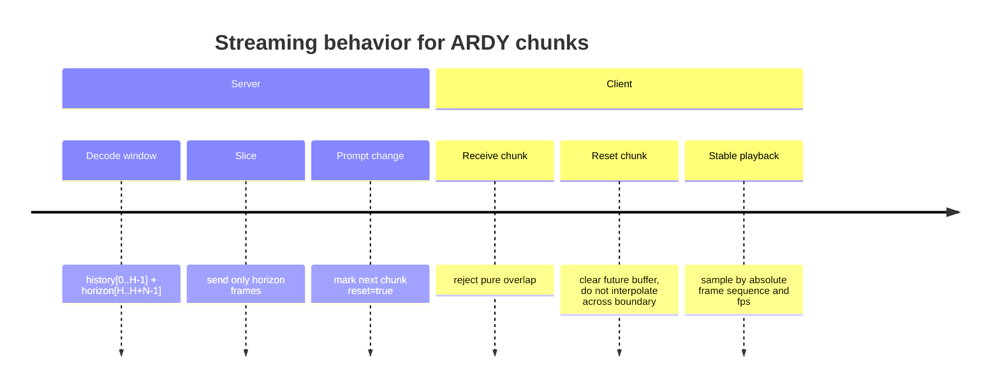
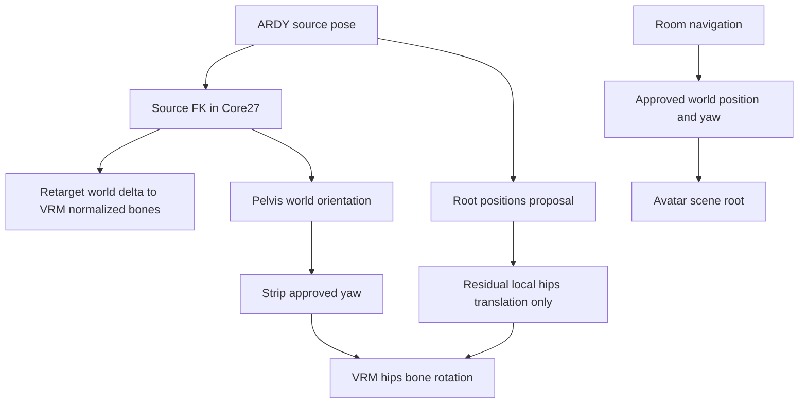

# ARDY to VRM Interoperability Audit

## Executive summary

The interoperability problems you described are real, reproducible, and technically coherent. The strongest verified conclusion is that the public ARDY release currently ships **Core27** and **G1** checkpoints, while **SOMA is announced but not yet publicly shipped**. That matters because Core27 and SOMA have several same-looking joint names that do **not** mean the same thing. The most dangerous collision is the leg chain: in **Core27**, `LeftUpLeg`/`RightUpLeg` are the thighs and `LeftLeg`/`RightLeg` are the lower legs; in **SOMA30**, `LeftLeg`/`RightLeg` are the thighs and `LeftShin`/`RightShin` are the lower legs. A retargeter that “matches by name” can therefore be nearly right while still producing systematically broken lower-body motion. citeturn3view1turn10view2turn10view3 fileciteturn0file0

The safest way to isolate the problem is to split the investigation into three layers. First, reproduce **raw Core27** in Three.js with **no VRM, no IK, no navigation**, using the official Core27 hierarchy together with rest offsets, `local_rot_mats`, and `root_positions`. Second, validate quaternion and matrix handling at the boundary: ARDY internally reconstructs rotations from 6D to matrices and its quaternion utilities are explicitly **real-part-first**; by contrast, Three.js `Quaternion` is documented as **`(x, y, z, w)`** and expects normalized quaternions. Third, only after the raw skeleton is correct, move to rest-compensated world-delta retargeting into three-vrm normalized bones. citeturn14view0turn14view1turn8search1turn14view3turn14view5 fileciteturn0file1

The public ARDY output contract is good enough for rigorous verification. `scripts/generate.py` writes `.npz` files, and ARDY’s motion representation returns `local_rot_mats`, `global_rot_mats`, `posed_joints`, `root_positions`, `smooth_root_pos`, `foot_contacts`, and `global_root_heading`. One subtle but important detail from the first-party audit is that, for ARDY, `smooth_root_pos` is currently just an alias of `root_positions`, so it should not be treated as a distinct smoothed trajectory in debugging logic. citeturn4view8turn6view1turn6view2turn6view3turn6view4turn6view5turn6view6 fileciteturn0file0

If I had to prioritize likely root causes, I would rank them this way: **wrong skeleton semantics**, then **quaternion-ordering or matrix-order mistakes**, then **incorrect retarget math** such as copying source locals directly into target locals, then **double application of root yaw**, and finally **streaming defects** like replaying history frames or interpolating across reset boundaries. The sections below turn those conclusions into exact reproduction steps, code, tests, mapping rules, and a staged debugging plan. fileciteturn0file0 fileciteturn0file1

## Source basis

This report is grounded primarily in official ARDY, Three.js, three-vrm, and VRM documentation, plus the two internal reconciliation documents you provided. The highest-value public sources are the official ARDY repository and README, the official ARDY skeleton definitions and geometry utilities, the official Three.js docs for `Quaternion`, `Matrix4`, `Object3D`, `Bone`, and `SkeletonHelper`, the official `@pixiv/three-vrm` docs for `VRMHumanoid` and `VRMHumanBoneName`, and the official VRM developer docs describing coordinate system, metric units, and the forward-axis difference between VRM 0.x and 1.0. citeturn3view0turn3view1turn3view2turn3view3turn8search1turn8search0turn7search0turn7search3turn9view0turn1search0turn1search6turn16view0turn16view1turn16view2

A critical limitation is that the **public ARDY `.npz` output does not itself contain rest offsets**. It contains the motion sample, not the full static skeleton contract. For a true FK-based raw reproduction in Three.js, you therefore need one additional skeleton-side artifact: a one-time capture of **Core27 rest offsets** and hierarchy. Your internal architecture note explicitly treats that as a `SkeletonContract`-style initialization step and recommends comparing it against ARDY’s skeleton definition before doing any retargeting work. If the only thing you have is `.npz`, you can still visualize `posed_joints` as a stick figure, but that does **not** verify your FK path. citeturn4view8turn6view3turn6view5 fileciteturn0file1

There is also one officially documented versioning fact that should drive your mapping logic. The ARDY README lists released **Core** and **G1** checkpoints and explicitly says the SOMA body-model skeleton is “coming soon.” That means production code should never assume “ARDY means SOMA” unless and until the actual checkpoint and joint list say so. citeturn4view5turn4view6

For source-following work, the most useful entry points are these: the ARDY README for output behavior and released checkpoints, `ardy/skeleton/definitions.py` for the actual Core27 and SOMA hierarchies, `ardy/geometry.py` for matrix and quaternion conventions, Three.js’s `Quaternion`, `Matrix4`, `Object3D`, and `SkeletonHelper` docs for transformation behavior, and `VRMHumanoid` / `VRMHumanBoneName` for the normalized humanoid retarget path. citeturn4view8turn10view2turn10view3turn14view0turn14view1turn8search1turn15view2turn14view2turn9view0turn14view3turn14view4turn14view5turn14view6

## Reproducing raw Core27 in Three.js

The goal of this phase is narrow and strict: **prove that the ARDY sample itself is decoded correctly in Three.js before VRM enters the picture**. That means rendering the official Core27 hierarchy with the correct rest offsets, applying `local_rot_mats` and `root_positions` frame by frame, and validating the result numerically against `posed_joints` and `global_rot_mats`. ARDY’s README documents that `generate.py` writes `.npz` motion files, and the motion representation code shows that those files contain both local and global rotation matrices together with `posed_joints` and root trajectories. citeturn4view8turn6view1turn6view3turn6view5

A correct reproduction pipeline has five exact steps. First, generate or load an ARDY `.npz` sample. Second, capture Core27 hierarchy plus rest offsets once, outside the frame loop. Third, build a pure `THREE.Bone` hierarchy that matches the official Core27 parentage. Fourth, on every frame, keep each child bone’s local position equal to its rest offset, set the root bone’s position from `root_positions[t]`, and set every bone’s local rotation from `local_rot_mats[t, j]`. Fifth, validate by checking that world bone positions match `posed_joints[t, j]` and world bone orientations match `global_rot_mats[t, j]`. `THREE.Bone` and `THREE.SkeletonHelper` are fully suitable for this because Three.js allows any bone hierarchy to be visualized with `SkeletonHelper`, not only skinned meshes. `Object3D.getWorldQuaternion()` gives you the world rotation needed for the comparison. citeturn7search3turn9view0turn14view2

Below is the exact Core27 hierarchy, taken from the official ARDY skeleton definitions. This is the hierarchy you should hardcode for debug-mode reproduction rather than inferring from motion samples. citeturn10view0turn11view0

```ts
export const CORE27: ReadonlyArray<{ name: string; parent: string | null }> = [
  { name: 'Hips', parent: null },

  { name: 'Spine', parent: 'Hips' },
  { name: 'Spine1', parent: 'Spine' },
  { name: 'Spine2', parent: 'Spine1' },
  { name: 'Spine3', parent: 'Spine2' },
  { name: 'Neck', parent: 'Spine3' },
  { name: 'Head', parent: 'Neck' },

  { name: 'RightShoulder', parent: 'Spine3' },
  { name: 'RightArm', parent: 'RightShoulder' },
  { name: 'RightForeArm', parent: 'RightArm' },
  { name: 'RightHand', parent: 'RightForeArm' },
  { name: 'RightHandEnd', parent: 'RightHand' },
  { name: 'RightHandThumb1', parent: 'RightHand' },

  { name: 'LeftShoulder', parent: 'Spine3' },
  { name: 'LeftArm', parent: 'LeftShoulder' },
  { name: 'LeftForeArm', parent: 'LeftArm' },
  { name: 'LeftHand', parent: 'LeftForeArm' },
  { name: 'LeftHandEnd', parent: 'LeftHand' },
  { name: 'LeftHandThumb1', parent: 'LeftHand' },

  { name: 'RightUpLeg', parent: 'Hips' },
  { name: 'RightLeg', parent: 'RightUpLeg' },
  { name: 'RightFoot', parent: 'RightLeg' },
  { name: 'RightToeBase', parent: 'RightFoot' },

  { name: 'LeftUpLeg', parent: 'Hips' },
  { name: 'LeftLeg', parent: 'LeftUpLeg' },
  { name: 'LeftFoot', parent: 'LeftLeg' },
  { name: 'LeftToeBase', parent: 'LeftFoot' },
];
```

The matrix-to-quaternion conversion is a common place to silently corrupt the reproduction. Three.js documents that `Matrix4.set(...)` is specified in **row-major** order, while `Matrix4.elements` are stored in **column-major** order internally, and `Quaternion.setFromRotationMatrix(...)` expects a proper rotation matrix. If your ARDY matrices come from NumPy-style row-major arrays, the safest boundary utility is to copy them into `Matrix4.set(...)` explicitly. citeturn15view2turn8search1

```ts
import * as THREE from 'three';

export function quatFromRowMajorMat3(m: readonly number[]): THREE.Quaternion {
  if (m.length !== 9) {
    throw new Error(`Expected 9 numbers for mat3, got ${m.length}`);
  }

  const M = new THREE.Matrix4().set(
    m[0], m[1], m[2], 0,
    m[3], m[4], m[5], 0,
    m[6], m[7], m[8], 0,
    0,    0,    0,    1,
  );

  return new THREE.Quaternion().setFromRotationMatrix(M).normalize();
}
```

The raw debug skeleton should be built once, with child-bone local positions permanently set to the Core27 rest offsets. The root bone is the only bone whose local position should be overwritten per frame from ARDY’s sampled root trajectory. The following skeleton builder assumes you have already captured `restOffsetsM: number[27][3]`. That capture can come from your one-time skeleton-contract export step; it should not be reconstructed from a motion clip unless you have explicitly verified that your reconstruction assumptions hold. fileciteturn0file1

```ts
type Vec3 = readonly [number, number, number];

export interface Core27Skeleton {
  root: THREE.Bone;
  bonesInOrder: THREE.Bone[];
  byName: Map<string, THREE.Bone>;
  helper: THREE.SkeletonHelper;
}

export function buildCore27Skeleton(
  scene: THREE.Scene,
  restOffsetsM: readonly Vec3[],
): Core27Skeleton {
  if (restOffsetsM.length !== CORE27.length) {
    throw new Error(`Expected ${CORE27.length} rest offsets, got ${restOffsetsM.length}`);
  }

  const byName = new Map<string, THREE.Bone>();
  const bonesInOrder: THREE.Bone[] = [];

  for (const joint of CORE27) {
    const bone = new THREE.Bone();
    bone.name = joint.name;
    byName.set(joint.name, bone);
    bonesInOrder.push(bone);
  }

  let root: THREE.Bone | null = null;

  for (let i = 0; i < CORE27.length; i++) {
    const joint = CORE27[i];
    const bone = bonesInOrder[i];
    const [x, y, z] = restOffsetsM[i];

    if (joint.parent === null) {
      root = bone;
      bone.position.set(0, 0, 0); // ARDY root_positions owns root translation per frame
    } else {
      bone.position.set(x, y, z);
      const parent = byName.get(joint.parent);
      if (!parent) throw new Error(`Missing parent bone: ${joint.parent}`);
      parent.add(bone);
    }
  }

  if (!root) throw new Error('Missing root bone');

  scene.add(root);
  const helper = new THREE.SkeletonHelper(root);
  scene.add(helper);

  return { root, bonesInOrder, byName, helper };
}
```

The frame application path should be equally simple. Do not put VRM, retargeting, navigation, or foot locking in the loop. In raw reproduction mode, your truth source is the ARDY skeleton itself. fileciteturn0file1

```ts
interface ArdyClip {
  fps: number;
  rootPositions: number[][];       // [T][3]
  localRotMats: number[][][];      // [T][27][9] row-major mat3 flattened
}

export function applyCore27Frame(
  skel: Core27Skeleton,
  clip: ArdyClip,
  frame: number,
): void {
  const rootPos = clip.rootPositions[frame];
  skel.root.position.set(rootPos[0], rootPos[1], rootPos[2]);

  for (let j = 0; j < skel.bonesInOrder.length; j++) {
    const q = quatFromRowMajorMat3(clip.localRotMats[frame][j]);
    skel.bonesInOrder[j].quaternion.copy(q);
  }

  skel.root.updateMatrixWorld(true);
}
```

The most important validation is a world-space comparison against ARDY’s own exported results. Because ARDY exports `posed_joints` and `global_rot_mats`, your Three.js reproduction can be tested numerically rather than visually guessed. In a correct raw renderer, world bone positions should match `posed_joints` up to small floating-point tolerance, and world bone orientations should match `global_rot_mats` up to quaternion sign ambiguity and small angular tolerance. citeturn6view3turn6view5

```ts
function angleBetweenQuats(a: THREE.Quaternion, b: THREE.Quaternion): number {
  // Handle q and -q representing the same rotation
  const dot = Math.abs(a.dot(b));
  return 2 * Math.acos(Math.min(1, Math.max(-1, dot)));
}

export function validateFrameAgainstArdy(
  skel: Core27Skeleton,
  posedJoints: number[][],        // [27][3]
  globalRotMats: number[][],      // [27][9]
): { maxPosErrM: number; maxAngErrRad: number } {
  let maxPosErrM = 0;
  let maxAngErrRad = 0;

  const p = new THREE.Vector3();
  const qWorld = new THREE.Quaternion();

  for (let j = 0; j < skel.bonesInOrder.length; j++) {
    const bone = skel.bonesInOrder[j];

    bone.getWorldPosition(p);
    const targetP = posedJoints[j];
    const posErr = p.distanceTo(new THREE.Vector3(targetP[0], targetP[1], targetP[2]));
    maxPosErrM = Math.max(maxPosErrM, posErr);

    bone.getWorldQuaternion(qWorld);
    const targetQ = quatFromRowMajorMat3(globalRotMats[j]);
    const angErr = angleBetweenQuats(qWorld, targetQ);
    maxAngErrRad = Math.max(maxAngErrRad, angErr);
  }

  return { maxPosErrM, maxAngErrRad };
}
```

For this raw phase, the most useful tests are deterministic and brutally simple:

| Test | Procedure | Expected result | Failure signature |
|---|---|---|---|
| Hierarchy test | Compare bone count, names, and parents against official Core27 | Exact match to 27 joints and parentage | Missing limbs, detached chains, mirrored subtrees |
| Rest-offset test | Apply identity local rotations and zero root translation | Skeleton rests in neutral bind layout | Bent default pose, crossed arms, collapsed chain |
| Position test | Compare world positions to `posed_joints` | Sub-millimeter to few-millimeter error | Systematic offset means wrong rest offsets or parent transforms |
| World-rotation test | Compare world quaternions to `global_rot_mats` | Very small angular error | Large consistent error means mat3 loading or quaternion extraction bug |
| Temporal continuity test | Advance one frame at a time at exported `fps` | Motion matches ARDY viewer timing | Snapping or micro-loops mean sequencing or frame indexing bug |

These tests are supported by the ARDY output contract and by the internal recommendation to keep a permanent “debug skeleton truth view” alongside the final avatar. citeturn4view8turn6view3turn6view5turn4view7 fileciteturn0file1

One practical point is easy to miss: ARDY’s own viewer detects the skeleton type from the file, which is useful as a sanity check when you compare your Three.js output to ARDY’s browser playback. If your raw Core27 renderer diverges from ARDY’s viewer on the same `.npz`, the bug is in your ingest, matrices, hierarchy, or rest offsets—not in VRM. citeturn4view7turn4view8

## Skeleton mapping and canonical naming rules

The table below is a **semantic interoperability table**, not a string-matching table. The “closest SOMA analogue” column is an inference from official joint parentage and chain position in the published Core27 and SOMA definitions, while the VRM target column follows the implementation-ready Core27→VRM mapping from your architecture note. That is exactly why this table is necessary: equality of strings is not equality of meaning. citeturn10view2turn10view3turn14view6 fileciteturn0file1

| ARDY Core27 joint | Core27 semantic role | Closest SOMA analogue | Common VRM humanoid target | Interop note |
|---|---|---|---|---|
| Hips | root / pelvis | Hips | `hips` | Same semantic root |
| Spine | lowest spine link | closest to `Spine1` | `spine` | Core has one extra spine link vs common VRM |
| Spine1 | lower-mid spine | closest to `Spine2` | `chest` | Name differs from SOMA meaning |
| Spine2 | upper-mid spine | closest to `Chest` | — | Usually chain-compressed |
| Spine3 | upper spine / chest base | between `Chest` and `Neck1` | `upperChest` | Use world-delta compression, not local copy |
| Neck | neck link | collapsed `Neck1`+`Neck2` | `neck` | Core has one neck link; SOMA has two |
| Head | head | Head | `head` | Straightforward |
| RightShoulder | shoulder | RightShoulder | `rightShoulder` | Optional in some VRMs |
| RightArm | upper arm | RightArm | `rightUpperArm` | Straightforward |
| RightForeArm | lower arm | RightForeArm | `rightLowerArm` | Straightforward |
| RightHand | hand | RightHand | `rightHand` | Straightforward |
| RightHandEnd | terminal marker | no direct SOMA equivalent | — | Do not map to VRM humanoid |
| RightHandThumb1 | first thumb link | closest to `RightHandThumb1` | `rightThumbProximal` | Core has only one thumb joint |
| LeftShoulder | shoulder | LeftShoulder | `leftShoulder` | Optional in some VRMs |
| LeftArm | upper arm | LeftArm | `leftUpperArm` | Straightforward |
| LeftForeArm | lower arm | LeftForeArm | `leftLowerArm` | Straightforward |
| LeftHand | hand | LeftHand | `leftHand` | Straightforward |
| LeftHandEnd | terminal marker | no direct SOMA equivalent | — | Do not map to VRM humanoid |
| LeftHandThumb1 | first thumb link | closest to `LeftHandThumb1` | `leftThumbProximal` | Core has only one thumb joint |
| RightUpLeg | thigh / upper leg | **RightLeg** | `rightUpperLeg` | **Different name, same role** |
| RightLeg | shin / lower leg | **RightShin** | `rightLowerLeg` | **Same-looking name, different role** |
| RightFoot | ankle / foot | RightFoot | `rightFoot` | Straightforward |
| RightToeBase | toe base | RightToeBase | `rightToes` | Optional in some VRMs |
| LeftUpLeg | thigh / upper leg | **LeftLeg** | `leftUpperLeg` | **Different name, same role** |
| LeftLeg | shin / lower leg | **LeftShin** | `leftLowerLeg` | **Same-looking name, different role** |
| LeftFoot | ankle / foot | LeftFoot | `leftFoot` | Straightforward |
| LeftToeBase | toe base | LeftToeBase | `leftToes` | Optional in some VRMs |

The single most consequential collision is the leg chain. In SOMA30, `LeftLeg` and `RightLeg` sit directly under `Hips`, which makes them thighs; the lower legs are `LeftShin` and `RightShin`. In Core27, `LeftUpLeg` and `RightUpLeg` sit under `Hips`, and `LeftLeg` / `RightLeg` sit one level below them, which makes those names lower legs. This is not a cosmetic naming difference; it is a semantic inversion. citeturn10view2turn10view3 fileciteturn0file0

The recommended canonical mapping rule is therefore simple: **never map by source string alone**. Instead, store an explicit `skeleton_type` such as `cskel27` or `somaskel30`, map each source joint to a canonical semantic token such as `leftUpperLeg`, `leftLowerLeg`, `spineLow`, `spineMid`, `spineHigh`, and only then map those canonical semantics to VRM humanoid names. This is the only robust way to survive same-name/different-meaning collisions and differing spine or neck chain lengths. citeturn10view2turn10view3turn1search6 fileciteturn0file1

A second mapping rule follows from the spine mismatch. Core27 has four spine links before the neck; common VRM humanoids expose `spine`, `chest`, and `upperChest`. The internal architecture’s recommendation—to map `Spine → spine`, `Spine1 → chest`, drop direct output for `Spine2`, and map `Spine3 → upperChest`—is reasonable **only if you retarget with world-space rest-compensated deltas**. If you instead copy locals, the omitted `Spine2` rotation is lost and the upper torso visibly lags. fileciteturn0file1

A third rule is to mark terminals and non-humanoid detail explicitly. `RightHandEnd`, `LeftHandEnd`, and the single-thumb joints in Core27 are useful as source-chain markers, but they are not a full VRM hand rig. That means they should either be omitted from humanoid retargeting or mapped to the minimal proximal thumb bones only, with the rest of the hand pose owned by another system if needed. `VRMHumanBoneName` in three-vrm includes many finger bones, but Core27 simply does not provide equivalent detail. citeturn14view6 fileciteturn0file1

## Quaternion conventions and retargeter math audit

On the ARDY side, the safest statement is this: **matrices are the primary debug representation**. ARDY reconstructs rotation matrices from 6D features using `cont6d_to_matrix(...)`, and its output contract exposes `local_rot_mats` and `global_rot_mats` directly. If you are trying to reproduce or verify raw motion, stay in matrix space for as long as you can. citeturn14view0turn6view3

When quaternions do appear, the convention mismatch is explicit. ARDY’s `matrix_to_quaternion(...)` says it returns quaternions with the **real part first**, and `quaternion_to_matrix(...)` unpacks them as `r, i, j, k`, which is a **`(w, x, y, z)`** convention. Three.js documents its `Quaternion` constructor and array order as **`(x, y, z, w)`** and also notes that quaternions are expected to be normalized. Because three-vrm exposes normalized bones as `THREE.Object3D`s, the practical VRM-side boundary is also the Three.js convention. citeturn14view1turn4view4turn8search1turn14view3

That yields a hard interoperability rule: if you ever send or store ARDY quaternions outside matrix form, you should wrap all conversions in named functions and ban direct constructor calls from boundary code. The safest utilities look like this. citeturn4view4turn8search1

```ts
import * as THREE from 'three';

export type ArdyQuatWXYZ = readonly [number, number, number, number];

export function ardyWxyzToThree(q: ArdyQuatWXYZ): THREE.Quaternion {
  const [w, x, y, z] = q;
  return new THREE.Quaternion(x, y, z, w).normalize();
}

export function threeToArdyWxyz(q: THREE.Quaternion): ArdyQuatWXYZ {
  const qq = q.clone().normalize();
  return [qq.w, qq.x, qq.y, qq.z];
}

export function assertUnitQuaternion(q: THREE.Quaternion, eps = 1e-3): void {
  const err = Math.abs(q.lengthSq() - 1);
  if (err > eps) {
    throw new Error(`Quaternion is not normalized: |q|^2 error=${err}`);
  }
}
```

The unit tests should be mechanical and unforgiving. A correct test suite should check identity, a known axis-angle rotation, round-trip conversion, normalization enforcement, and a deliberate negative test that proves `new THREE.Quaternion(w, x, y, z)` is wrong for ARDY-style data. Three.js exposes `lengthSq()`, `angleTo()`, and the `(x, y, z, w)` constructor order directly, so these tests can be written without hidden assumptions. citeturn8search1turn15view0

```ts
import { describe, it, expect } from 'vitest';
import * as THREE from 'three';

describe('ARDY quaternion boundary', () => {
  it('converts identity correctly', () => {
    const q = ardyWxyzToThree([1, 0, 0, 0]);
    expect(q.angleTo(new THREE.Quaternion(0, 0, 0, 1))).toBeLessThan(1e-6);
  });

  it('round-trips a 90-degree Y rotation', () => {
    const src = new THREE.Quaternion().setFromAxisAngle(
      new THREE.Vector3(0, 1, 0),
      Math.PI / 2,
    );
    const wire = threeToArdyWxyz(src);
    const dst = ardyWxyzToThree(wire);
    expect(dst.angleTo(src)).toBeLessThan(1e-6);
  });

  it('rejects accidental wxyz-as-xyzw construction', () => {
    const correct = ardyWxyzToThree([0.70710678, 0, 0.70710678, 0]); // 90 deg about Y
    const wrong = new THREE.Quaternion(0.70710678, 0, 0.70710678, 0).normalize();
    expect(correct.angleTo(wrong)).toBeGreaterThan(0.1);
  });

  it('checks normalization', () => {
    const q = new THREE.Quaternion(1, 2, 3, 4);
    expect(() => assertUnitQuaternion(q, 1e-6)).toThrow();
    expect(() => assertUnitQuaternion(q.normalize(), 1e-6)).not.toThrow();
  });
});
```

The retargeter math should also be treated as a boundary problem rather than an animation “feel” issue. The correct formulation is to compute the source bone’s **world-space delta from its rest pose**, apply that delta to the target bone’s **rest world orientation**, and then convert the result back into the target parent’s local frame. The internal architecture states this directly, and it lines up with how three-vrm normalized poses are described: local transforms are stored **relative to rest pose**. fileciteturn0file1 citeturn14view5

```text
source_delta_world(t) = source_current_world(t) × inverse(source_rest_world)

target_current_world(t) = source_delta_world(t) × target_rest_world

target_current_local(t) = inverse(target_parent_current_world(t)) × target_current_world(t)
```

The three most common implementation mistakes are easy to state and easy to catch:

| Mistake | Why it is wrong | Typical symptom |
|---|---|---|
| `target.local = source.local` | Assumes identical rest frames and parent frames | Bent limbs, twisted shoulders, wrong elbow/knee axes |
| `target.local = source.world` | Writes a world orientation into a local slot | Chaotic hierarchy-dependent rotations |
| `target.world = source.world` without rest compensation | Ignores bind/rest orientation mismatch | Pose looks close in some bones, badly offset in others |

These failure modes are exactly what your internal reconciliation warns about, and they are also why the report’s earlier recommendation to validate the raw Core27 skeleton first is so important. fileciteturn0file0 fileciteturn0file1

A corrected pseudocode pass in Three.js looks like this:

```ts
interface BoneCalibration {
  sourceName: string;
  targetName: string;
  sourceRestWorld: THREE.Quaternion;
  targetRestWorld: THREE.Quaternion;
}

function retargetFrame(
  sourceWorldByName: Map<string, THREE.Quaternion>,
  targetNormalizedByName: Map<string, THREE.Object3D>,
  calibrations: BoneCalibration[],
): void {
  const targetWorldCurrent = new Map<string, THREE.Quaternion>();

  for (const c of calibrations) {
    const sourceCurrentWorld = sourceWorldByName.get(c.sourceName);
    const targetNode = targetNormalizedByName.get(c.targetName);
    if (!sourceCurrentWorld || !targetNode) continue;

    const sourceDeltaWorld = sourceCurrentWorld
      .clone()
      .multiply(c.sourceRestWorld.clone().invert())
      .normalize();

    const desiredTargetWorld = sourceDeltaWorld
      .clone()
      .multiply(c.targetRestWorld)
      .normalize();

    let parentWorld = new THREE.Quaternion(0, 0, 0, 1);
    if (targetNode.parent?.name && targetWorldCurrent.has(targetNode.parent.name)) {
      parentWorld = targetWorldCurrent.get(targetNode.parent.name)!.clone();
    } else if (targetNode.parent) {
      targetNode.parent.getWorldQuaternion(parentWorld);
    }

    const targetLocal = parentWorld
      .clone()
      .invert()
      .multiply(desiredTargetWorld)
      .normalize();

    targetNode.quaternion.copy(targetLocal);
    targetWorldCurrent.set(targetNode.name, desiredTargetWorld);
  }
}
```

Because three-vrm exposes normalized humanoid bones as `THREE.Object3D`s and, by default, copies normalized pose into raw bones on `update()`, the cleanest retarget target is the normalized rig. `getNormalizedBoneNode(...)` gives you those nodes; `autoUpdateHumanBones` is `true` by default; and `update()` transfers normalized pose to raw bones. citeturn14view3turn14view4turn14view5

The log you want during retargeting should be per-bone and explicit. If you log only final local quaternions, you will lose the evidence of where the calculation first diverged. A good diagnostic payload is this:

```ts
interface RetargetDiagnosticRow {
  frame: number;
  sourceName: string;
  targetName: string;
  sourceRestWorldWXYZ: [number, number, number, number];
  targetRestWorldXYZW: [number, number, number, number];
  sourceDeltaWorldXYZW: [number, number, number, number];
  targetDesiredWorldXYZW: [number, number, number, number];
  targetParentWorldXYZW: [number, number, number, number];
  targetLocalXYZW: [number, number, number, number];
  targetLocalNormError: number;
}
```

Finally, one matrix-specific trap deserves explicit attention. Three.js’s `Matrix4` docs warn that `fromArray(...)` expects **column-major** order, while many upstream motion pipelines store flattened arrays in row-major order. If you ingest ARDY `global_rot_mats` or `local_rot_mats` with the wrong major order, the resulting orientations can be consistently wrong without producing obvious NaNs. In practice, this often masquerades as a quaternion problem. citeturn15view2

## Streaming, transform ownership, and prioritized debugging

The temporal side of the pipeline matters almost as much as the pose math. Your internal reconciliation makes two especially important points: ARDY autoregressive output may contain **history plus horizon**, so only the newly generated horizon frames should be appended to playback; and root yaw must not be applied to both the scene root and the hips bone, or the avatar can visibly over-rotate. Those are classic “the math is mostly right, but the system still looks cursed” failure modes. fileciteturn0file0 fileciteturn0file1

The server-side chunk assembly should therefore slice history before sending. The following pattern embodies the intended behavior:

```ts
interface OutgoingChunk {
  reset: boolean;
  chunkSeq: number;
  frameSeqStart: number;
  fps: number;
  frames: Frame[];
}

function makeChunk(
  decoded: Frame[],      // history + newly generated frames
  historyLen: number,
  state: { nextChunkSeq: number; nextFrameSeq: number; pendingReset: boolean; fps: number; },
): OutgoingChunk {
  const newFrames = decoded.slice(historyLen);

  const chunk: OutgoingChunk = {
    reset: state.pendingReset,
    chunkSeq: state.nextChunkSeq++,
    frameSeqStart: state.nextFrameSeq,
    fps: state.fps,
    frames: newFrames,
  };

  state.nextFrameSeq += newFrames.length;
  state.pendingReset = false;
  return chunk;
}
```

The client-side buffer should then be sequence-aware, reject pure overlap, and treat reset as a discontinuity rather than something to smooth through. This is where many pipelines accidentally replay history or interpolate across incompatible prompts. fileciteturn0file1

```ts
class ChunkBuffer {
  private lastAcceptedFrame = -1;
  private chunks: OutgoingChunk[] = [];

  push(chunk: OutgoingChunk): void {
    if (chunk.reset) {
      this.chunks = [];
      this.lastAcceptedFrame = chunk.frameSeqStart - 1;
    }

    const end = chunk.frameSeqStart + chunk.frames.length - 1;
    if (end <= this.lastAcceptedFrame) return;

    if (chunk.frameSeqStart <= this.lastAcceptedFrame) {
      const trim = this.lastAcceptedFrame - chunk.frameSeqStart + 1;
      chunk = {
        ...chunk,
        frameSeqStart: chunk.frameSeqStart + trim,
        frames: chunk.frames.slice(trim),
      };
    }

    this.chunks.push(chunk);
    this.chunks.sort((a, b) => a.frameSeqStart - b.frameSeqStart);
    this.lastAcceptedFrame = Math.max(this.lastAcceptedFrame, end);
  }
}
```

The root-motion ownership rule should be equally strict. VRM and Three.js live in a right-handed, Y-up coordinate system with metric units; VRM’s developer docs also note the forward-axis difference between 0.x and 1.0, with VRM 1.0 facing `+Z`. Your internal architecture’s resolution—to let the **scene root own approved world translation and yaw**, while the **hips bone receives pelvis orientation with scene yaw stripped off**—is the right way to prevent doubled yaw. citeturn16view0turn16view1turn16view2 fileciteturn0file1

```ts
const Y_AXIS = new THREE.Vector3(0, 1, 0);

function sceneYawQuat(yawRad: number): THREE.Quaternion {
  return new THREE.Quaternion().setFromAxisAngle(Y_AXIS, yawRad);
}

// pelvisWorldQ is the ARDY pelvis world orientation after source FK
// approvedYawRad is the navigation-approved world yaw for the avatar scene root
function computeHipsRotationWithoutDoubleYaw(
  pelvisWorldQ: THREE.Quaternion,
  approvedYawRad: number,
): THREE.Quaternion {
  const rootYawQ = sceneYawQuat(approvedYawRad);
  return rootYawQ.clone().invert().multiply(pelvisWorldQ).normalize();
}
```

A compact timeline diagram helps make the history-slicing and reset rules concrete:



The transform-ownership split is equally important to visualize:



The staged debugging plan below is the order I would recommend in practice. It matches the internal architecture’s staged implementation plan, but is adapted into a failure-driven QA checklist. fileciteturn0file1

| Stage | What to enable | Concrete test | Pass criterion | Typical failure signature |
|---|---|---|---|---|
| Raw source reproduction | Core27 only; no VRM | Compare world positions/orientations against `posed_joints` and `global_rot_mats` | Very small position and angle error | Wrong quaternion/matrix order, wrong hierarchy, wrong rest offsets |
| Static retarget frame | Single frame into VRM normalized bones | T-pose, raised arm, bent knee, pelvis yaw, torso twist | Correct limb ownership and no mirror/twist artifacts | Bad mapping, copying locals, skipped parent inverse |
| Recorded clip retarget | File replay, still no streaming | Known clip played start to finish | Continuous motion, plausible chest and legs | Chain compression bug, bad rest calibration |
| Root translation and yaw | Scene root + hips residual | Walk forward, turn, crouch | No double yaw, no drifting hips translation | “Exorcist twist,” feet orbiting body, pelvis drift |
| Live chunk streaming | Buffer, seq numbers, reset | Overlapping chunks, prompt changes, simulated latency | No replay of history, reset crossfades cleanly | Micro-loops, hitching, interpolation across reset |
| Contact cleanup | Foot lock or minor IK only | Walk-stop-turn test | Reduced stance skate only | Contact solver fighting bad source pose |

The most useful visual diagnostics in this phase are not pretty renders; they are **comparative diagnostics**. I recommend keeping these artifacts visible at all times during debugging:

| Diagnostic | What it shows | Best failure signatures |
|---|---|---|
| Side-by-side screenshot triptych | ARDY viewer vs raw Core27 Three.js vs retargeted VRM | Separates source decode bugs from retarget bugs |
| Per-bone position-error plot | `|| worldPos_three - posed_joints ||` over time | Rest-offset and hierarchy errors spike persistently |
| Per-bone angular-error heatmap | World orientation error against `global_rot_mats` | Matrix-order and quaternion-boundary bugs show broad-band error |
| Root trajectory plot | proposed root vs approved root vs hips residual | Double application or navigation divergence |
| Buffer occupancy timeline | frames buffered vs generation latency vs resets | History replay and underruns become obvious |

These plots and screenshots are not directly prescribed by the official docs, but they follow from the official output contract and from the internal architecture’s insistence on a separate “debug skeleton truth” path and explicit chunk buffering. citeturn6view3turn6view5turn7search1 fileciteturn0file1

The final practical conclusion is straightforward. If you first prove that raw Core27 reproduces ARDY’s own outputs, then validate quaternion and matrix boundaries, then apply rest-compensated world-delta retargeting into three-vrm normalized bones, most of the remaining “pipeline” bugs become sharply localized. If, on the other hand, you debug VRM, streaming, root motion, and source decoding simultaneously, the exact same underlying issue can impersonate half a dozen different symptoms. That is the central architectural lesson from the materials you shared, and it is well supported by both the official sources and the internal audit. citeturn4view8turn14view3turn14view4turn14view5 fileciteturn0file0 fileciteturn0file1